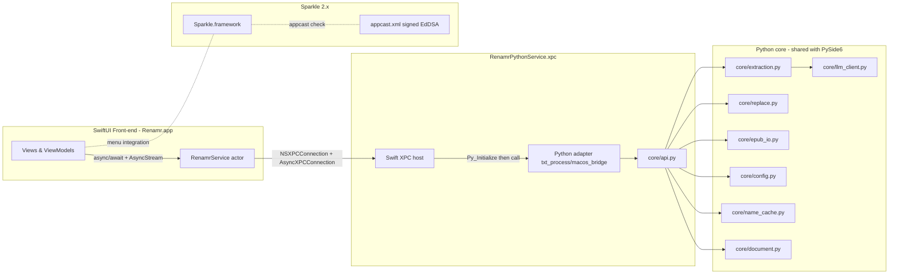
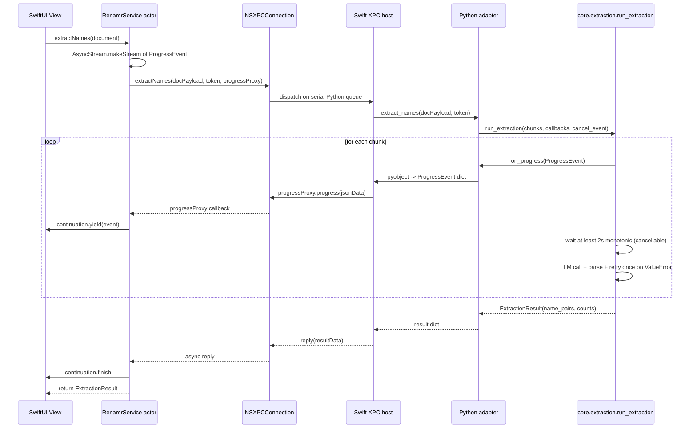
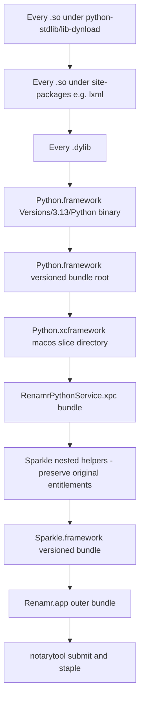

# feat: Native macOS SwiftUI Shell with Embedded Python (XPC Sidecar)

**Date:** 2026-06-08
**Status:** active
**Branch:** `swiftui-pilot`
**Origin:** `docs/brainstorms/2026-06-08-swiftui-macos-rebuild-requirements.md`
**Depth:** Deep

---

## Summary

Ship a native macOS app, `Renamr.app`, with a SwiftUI front-end and a bundled `RenamrPythonService.xpc` sidecar hosting the existing `txt_process/core/` Python business logic. Communication runs over `NSXPCConnection` with bidirectional protocols, bridged into Swift Concurrency via `AsyncStream` for progress events. The PySide6 app continues to ship for Windows/Linux against the same `core/`. Distribution is Developer ID + notarization + Sparkle 2.x auto-update; no Mac App Store.

The plan consolidates extraction orchestration (chunking driver, ≥2s cadence enforcement, phased state machine, corrective retry, X-RateLimit handling) and API-key persistence policy into `core/` so both UIs share them, introduces a `core/api.py` single-entry-point that both UIs consume, and adds a `tests/scenarios/` parity harness that exercises the shared core end-to-end.

---

## Problem Frame

Today's `Renamr.app` is built via PyInstaller from the PySide6 source. The bundle is ~150-200MB, uses Qt look-and-feel on macOS, and ships without a first-class updater. The brainstorm pinned the driver as **outside-store distribution that feels native, ships a smaller bundle, and supports auto-updates** (not Mac App Store). The PySide6 UI must continue to work on Windows/Linux against the unchanged `core/`.

Open Questions in the origin doc all reduced to technical/architectural decisions resolvable in planning. They are answered in Key Technical Decisions below; nothing is being deferred back to `ce-brainstorm`.

---

## Requirements Traceability

Every requirement, invariant, and success criterion below is carried verbatim from `docs/brainstorms/2026-06-08-swiftui-macos-rebuild-requirements.md`. R-IDs are plan-local for cross-reference inside the plan.

| ID | Requirement | Origin section |
|---|---|---|
| R1 | Load `.txt` with existing encoding-fallback behavior | Functional requirements / Document handling |
| R2 | Load `.epub`; reject DRM/font-obfuscated with `EpubEncryptedError` at load time | Same |
| R3 | Small-document extraction (`total_chunks <= begin_scan_chunks`): serial LLM call per chunk | Functional requirements / Name extraction |
| R4 | Large-document phased extraction (Phase 1 seed, Phase 2 local scan, Phase 3 targeted fill) | Same |
| R5 | Stream progress (`i/N`, stage label, running dedup name list); cancellable mid-flight | Same |
| R6 | Two-column editable name table; drop names with `occurrence_count == 0`; helpers (filter edited-only, search, reset row / reset all) | Functional requirements / Name editor |
| R7 | Replacement-name cache + autocomplete in the editable column | Same |
| R8 | CSV import (`source,target`); keep only rows with `occurrence_count > 0` | Functional requirements / CSV import |
| R9 | Settings persistence: full Config schema in `platformdirs` JSON; `remember_api_key` policy honored | Functional requirements / Settings |
| R10 | Normalize Layout — TXT-only; action surfaced only when a `.txt` is loaded | Functional requirements / Normalize Layout |
| R11 | Replace/export: only non-empty different replacements applied; length-descending order; boundary/case-aware ASCII matching; exact substring for non-ASCII; output filename inserts `_processed`; alternate directory prompt on permission failure | Functional requirements / Replace / export |
| R12 | EPUB output preserves container structure (chapters, CSS, images, fonts, TOC) byte-for-byte for non-text assets; XHTML/NCX via `lxml-xml` with DOCTYPE re-prepended; zip written directly, bypassing `ebooklib.write_epub`. Preserved as-is in `txt_process/core/epub_io.py` (not modified by this plan); verified at scenario level in U5. | Same |
| I1 | Chunk size strictly `< 16 * 1024` UTF-8 bytes; consecutive paragraphs in original order; oversized-paragraph fallback uses zero-width lookbehind sentence split | Invariants |
| I2 | LLM calls serial only; ≥2.0s between request starts via monotonic clock; cadence applies to corrective retry too | Invariants |
| I3 | Endpoint routing: port `11434` → Ollama `/api/chat`; otherwise OpenAI-compatible `chat.completions`; Ollama API key may be empty | Invariants |
| I4 | Parse contract: strict JSON `{"names": [...]}`; one corrective retry with stricter instruction on parse failure; no heuristic line-by-line fallback; second failure surfaces `ValueError` | Invariants |
| I5 | Occurrence counting and replacement matching share `core.replace.count_name_occurrences` (single source of truth) | Invariants |
| I6 | API key never logged, echoed, or surfaced in error dialogs; persisted plaintext only when `remember_api_key=True`, otherwise session-only | Invariants |
| Q1 | XPC service auto-restart on crash; per-call timeouts; cancellation propagated to the Python side | Architectural shape |
| Q2 | Process-isolated Python: a crash in the sidecar must not kill the SwiftUI app | Goals |
| Q3 | PySide6 app remains fully functional on Windows/Linux against the same `txt_process/core/` after the rebuild | Goals + Non-goals |

---

## Key Technical Decisions

Each decision below resolves an open question from the origin brainstorm. Each cites the load-bearing research finding that informed it; see Sources & Research at the end.

### KTD1 — Embedded Python via BeeWare `python-apple-support` (Python.xcframework, 3.13 branch)

Bundle BeeWare's prebuilt `Python.xcframework` (macOS slice only) + `python-stdlib/` payload inside the XPC service bundle. Rejected alternatives: python.org's `Python.framework` (requires post-install `install_name_tool` relocation with `gregneagle/relocatable-python`; higher maintenance), Apple's PythonKit (in-process embedding; loses process isolation goal Q2). The 3.13 branch is BeeWare's recommended embedding target in 2026 and has working universal2 `lxml` wheels available.

Rationale: lower-risk default; designed for embedding; signing patterns already solved by BeeWare; BSD-3-Clause license.

### KTD2 — `NSXPCConnection` bridge, not `XPCSession`

Use the classic `NSXPCConnection` API with bidirectional `@objc` protocols (`RenamrServiceProtocol` exported by the service; `RenamrProgressProtocol` exported by the client for progress callbacks). The newer Swift `XPCSession`/`XPCListener` (macOS 14+) is GA but lacks first-class bidirectional callbacks and `NSProgress` bridging — workable but a worse fit for our streaming-progress use case. Neither API is deprecated; both will coexist.

Payload shape for rich types (name-pair lists with counts, settings dict, progress events): JSON-encoded `Data` envelopes inside the `@objc` method signatures, decoded into `Codable` Swift structs on the client side. Avoids `NSSecureCoding` whitelist pain.

### KTD3 — `ChimeHQ/AsyncXPCConnection` for Swift Concurrency adapter

Adopt the `AsyncXPCConnection` SwiftPM package (MIT) instead of hand-rolling continuation/`AsyncStream` plumbing around `NSXPCConnection`. It's the most production-tested adapter, ~600 LOC, Swift 6 strict-concurrency clean, and gives us `async` shims + `withTaskCancellationHandler` + interruption-handler reset logic for free. Wrap our app-specific protocol shape on top of its primitives.

### KTD4 — Progress events as `AsyncStream<ProgressEvent>`, cancellation via explicit `cancel(token:)`

Long-running calls (e.g., `extractNames`) return immediately with a token; the client subscribes to an `AsyncStream<ProgressEvent>` keyed by token. The stream is built from the client's exported `RenamrProgressProtocol` callbacks via `AsyncStream.makeStream(of:)` + `continuation.yield(...)`. Cancellation: `continuation.onTermination` sends a `cancel(token:)` message to the service, which sets a `threading.Event` the Python extraction loop polls between chunks (natural break point at the ≥2s cadence wait).

### KTD5 — Orchestration relocates to `core/extraction.py` (shared by both UIs)

Move the chunking driver, ≥2s cadence enforcement, phased extraction state machine, corrective retry on parse failure, and `X-RateLimit-Reset` regex handling out of `txt_process/ui/workers.py` and into a new `txt_process/core/extraction.py`. Expose `run_extraction(...)` taking abstract callback objects for progress reporting, log emission, and cancellation polling. PySide6's `ui/workers.py` becomes a thin Qt adapter; the Python XPC service becomes an equally thin XPC adapter. Both call the same `core.api.extract_names(...)`. Honors the brainstorm's "parallel long-term" commitment by eliminating duplicate orchestration.

### KTD6 — Single entry point `core/api.py` consumed by both UIs

Introduce `txt_process/core/api.py` exposing the small set of callable functions every UI needs: `load_document`, `extract_names` (the orchestration driver), `commit_name_pairs`, `replace_and_export`, `read_settings`, `write_settings`, `normalize_layout`, `load_name_cache`, `save_name_cache`. Anything outside `core.api` is private to `core/`. Both UIs import only from `core.api`. The XPC protocol is a faithful mapping of this surface.

### KTD7 — API-key blanking enforcement in `core/config.save_config()`

Move the `remember_api_key=False → blank persisted key` policy out of `ui/settings_dialog.py` + `ui/main_window.py` and into `core/config.save_config()`. Single source of truth; PySide6 inherits the cleanup for free. The session-only key remains held in the UI layer (where it logically belongs).

### KTD8 — Sparkle 2.7.x with EdDSA, full updates only

Integrate Sparkle 2.7.x (SwiftPM) for auto-update. Use EdDSA signing (`generate_keys` → keychain → public key in `Info.plist` as `SUPublicEDKey`; `generate_appcast` produces signed `<enclosure sparkle:edSignature="...">`). Ship **full updates only**, not delta updates: bytewise-reproducible `.pyc` files would require `PYTHONHASHSEED=0` + `SOURCE_DATE_EPOCH` discipline in CI that isn't worth the complexity for a <80MB app. Re-sign Sparkle's nested helpers preserving their original entitlements (extract via `codesign -d --entitlements -`, re-apply with `codesign --entitlements`).

### KTD9 — Hardened runtime entitlements on the XPC service, not the outer app

The XPC service binary needs `com.apple.security.cs.allow-unsigned-executable-memory` (CPython interpreter requires it; `allow-jit` does not apply because CPython doesn't use the `MAP_JIT` flag) and `com.apple.security.cs.disable-library-validation` (CPython dlopens signed-by-team but loader-unanticipated `.so` paths). The outer `Renamr.app` keeps minimal entitlements. Sparkle's nested helpers keep their shipped entitlements unchanged.

### KTD10 — Sign innermost-first, never `--deep` on outer

The signing pipeline walks the bundle innermost-first: every `.so` under `python-stdlib/lib-dynload/` and `site-packages/`, then dylibs, then `Python.framework` versioned bundle, then the xcframework slice, then `RenamrPythonService.xpc`, then Sparkle's nested helpers (preserving their entitlements), then `Sparkle.framework`, then `Renamr.app`. Use `--options runtime --timestamp --sign "Developer ID Application: ..."` on each. Never `codesign --deep` on the outer app — it strips child entitlements and is the documented #1 cause of nested-bundle notarization failures.

### KTD11 — Repo layout: `macos/` at repo root for all Swift/Xcode assets

Add a new top-level `macos/` directory containing the Xcode project, Swift sources, build scripts, entitlements files, and Sparkle configuration. Keeps the Python tree (`txt_process/`) cleanly separated from the macOS shell. Tests for `core/` stay under `tests/`; Swift unit tests (if any) live under `macos/Tests/`. The Python XPC service's Python adapter code lives under `txt_process/macos_bridge/` so it can be tested alongside the rest of the Python codebase.

### KTD12 — Bundle-size target as a Success Criterion, not a ship gate

Set ≤80MB as a Success Criterion the build pipeline measures and reports. Exceeding it does not block v1 release; it triggers a follow-up task to investigate (typically: trim more stdlib, vendor a slimmer `lxml`, or strip more `__pycache__`).

---

## High-Level Technical Design

### Component architecture



The PySide6 app (`txt_process/ui/`) is unchanged in shape on the diagram — it also calls into `core/api.py`, just via direct in-process Python imports instead of XPC.

### Extraction-with-streaming-progress sequence



Cancellation path: SwiftUI `Task` cancellation → `continuation.onTermination` → `cancelProxy.cancel(token)` XPC message → Python adapter sets the `threading.Event` cancel flag → `core.extraction` polls the flag between the ≥2s wait and the LLM call. Worst-case cancel latency = remaining cadence wait + in-flight LLM HTTP call (typically <30s due to timeout).

### XPC connection lifecycle (state machine)

```mermaid
stateDiagram-v2
    [*] --> Disconnected
    Disconnected --> Connecting: first method call
    Connecting --> Connected: invocation succeeds
    Connecting --> Disconnected: invalidationHandler fires
    Connected --> Interrupted: service crashed; can reuse
    Connected --> Invalidated: invalidationHandler fires
    Interrupted --> Connecting: next call triggers relaunch
    Invalidated --> Disconnected: connection released
    Disconnected --> [*]: app quit
```



In-flight requests during Interrupted/Invalidated: the `remoteObjectProxyWithErrorHandler` path raises an error into the awaiting continuation, which becomes a recoverable error in the SwiftUI layer (offer Retry). The `RenamrService` actor recreates the `NSXPCConnection` lazily on the next call.

### Codesigning order (innermost first)



Each step runs `codesign --options runtime --timestamp --sign "Developer ID Application: ..."`. Never `--deep` on the outer app.

---

## Output Structure

New files and directories introduced by this plan (existing layout under `txt_process/`, `tests/`, `docs/`, `scripts/` unchanged unless explicitly listed in a unit's `**Files:**`):

```
txt_process/
  core/
    api.py                              (new) single entry point both UIs consume
    extraction.py                       (new) extraction orchestration moved out of ui/workers.py
  macos_bridge/
    __init__.py                         (new)
    service.py                          (new) Python XPC adapter calling core/api
    progress.py                         (new) ProgressEvent dataclass + serialization

tests/
  scenarios/
    __init__.py                         (new)
    test_extract_to_export_txt.py       (new) end-to-end txt scenario via core.api
    test_extract_to_export_epub.py      (new) end-to-end epub scenario via core.api
    test_config_remember_key.py         (new) API-key blanking policy in core.config
  test_extraction.py                    (new) unit tests for core/extraction.py

macos/
  Renamr.xcodeproj/                     (new) Xcode project
  Renamr/                               (new) SwiftUI app target sources
    RenamrApp.swift
    Views/
      MainView.swift
      NameEditorView.swift
      SettingsView.swift
      ExtractionProgressView.swift
    ViewModels/
      DocumentViewModel.swift
      NameEditorViewModel.swift
      SettingsViewModel.swift
    Services/
      RenamrService.swift               actor wrapping NSXPCConnection
      RenamrProtocols.swift             @objc service + progress protocols
      ProgressEvent.swift               Codable Swift type
    Resources/
      Assets.xcassets
      Info.plist
    Renamr.entitlements                 (minimal)
  RenamrPythonService/                  (new) XPC service target sources
    main.swift                          loads Python.xcframework, Py_Initialize, registers service
    PythonBridge.swift                  calls into txt_process.macos_bridge.service
    Info.plist
    RenamrPythonService.entitlements    (allow-unsigned-executable-memory, disable-library-validation)
  Vendored/                             (gitignored; produced by build script)
    Python.xcframework/                 from python-apple-support release
    python-stdlib/
    app_packages/                       pip-installed wheels
  Scripts/
    vendor_python.sh                    download python-apple-support + pip install wheels + prune
    sign_bundle.sh                      innermost-first codesign walk
    notarize.sh                         notarytool submit + staple
    build_dmg.sh                        create-dmg invocation
    generate_appcast.sh                 Sparkle generate_appcast wrapper
  Tests/                                Swift unit tests (optional, scenario-light)

docs/
  plans/
    2026-06-08-001-feat-macos-swiftui-shell-plan.md   this plan
  brainstorms/
    2026-06-08-swiftui-macos-rebuild-requirements.md   origin
```

The per-unit `**Files:**` sections remain authoritative for what each unit creates.

---

## Implementation Units

### U1. Introduce `core/api.py` single entry point
**Status:** Completed (2026-06-09)

**Goal:** Provide the canonical callable surface that both the PySide6 UI and the Python XPC adapter consume. Nothing outside `core.api` is imported by UI layers.

**Requirements:** Enables Q3 (PySide6 stays functional), KTD6 (single entry point).

**Dependencies:** None (first unit).

**Files:**
- `txt_process/core/api.py` (new)
- `tests/test_api.py` (new)

**Approach:**
- Define functions matching the small set both UIs need: `load_document(path) -> Document`, `extract_names(document, config, callbacks) -> ExtractionResult`, `commit_name_pairs(document, pairs) -> None` (no-op in v1 but reserves the seam), `commit_imported_pairs(document, pairs) -> list[NameRow]` (CSV import: counts occurrences via `core.replace.count_name_occurrences`, filters zero-count rows; used by U16), `replace_and_export(document, mappings, output_path) -> ReplaceResult`, `read_settings() -> Config`, `write_settings(config) -> None`, `normalize_layout(input_path, output_path) -> None`, `load_name_cache() -> list[str]`, `save_name_cache(names) -> list[str]`.
- Each function is a thin façade over the existing modules (`core.document.load_document`, `core.config.load_config`/`save_config`, `core.normalize_txt.normalize_text_file`, `core.name_cache.*`). `extract_names` will delegate to `core.extraction.run_extraction` once U2 lands; for this unit, leave a stub raising `NotImplementedError` and wire it in U2.
- Define plan-stable dataclasses: `ExtractionResult` (name_pairs: list[tuple[str,str]], counts: dict[str,int], errors: list[str]), `ReplaceResult` (totals: dict[str,int], per_item: dict[str, dict[str,int]] | None).
- Define `ExtractionCallbacks` protocol with `on_progress(ProgressEvent)`, `on_log(str)`, `on_chunk_names(list[str])`, `should_cancel() -> bool` methods. (The Python XPC adapter and the Qt worker each provide a concrete implementation.)
- Re-export the necessary types so UIs only need `from txt_process.core.api import ...`.

**Patterns to follow:**
- Module-level façade pattern. Match the docstring/type-hint style in existing `core/` modules.
- Follow dataclass usage from `core.config.Config`.

**Test scenarios:**
- Happy path: `core.api.load_document` returns the same `Document` instance as `core.document.load_document` for a `.txt` fixture.
- Happy path: `core.api.read_settings` returns the same `Config` as `core.config.load_config` (mock the config dir).
- Edge case: `core.api.extract_names` raises `NotImplementedError` until U2 wires it up. (Remove this scenario in U2.)
- Integration: `core.api` re-exports `Config`, `ExtractionResult`, `ReplaceResult`, `ExtractionCallbacks` so UIs don't need to reach past `core.api`.

**Verification:**
- `pytest tests/test_api.py` passes.
- `rg "from txt_process.core\." txt_process/ui/` after U4 shows imports only from `core.api`, never deeper.

---

### U2. Extract orchestration into `core/extraction.py`
**Status:** Completed (2026-06-09)

**Goal:** Move chunking driver, ≥2s cadence enforcement, phased extraction state machine, corrective retry on parse failure, and `X-RateLimit-Reset` regex handling out of `txt_process/ui/workers.py` into pure-Python `core/extraction.py`. Keep cancellation cooperative via the callback protocol.

**Requirements:** R3, R4, R5, I1, I2, I4, KTD5.

**Dependencies:** U1 (defines the `ExtractionCallbacks` protocol and `ExtractionResult` dataclass).

**Files:**
- `txt_process/core/extraction.py` (new)
- `tests/test_extraction.py` (new)
- `txt_process/ui/workers.py` (refactor — see U4)

**Approach:**
- Public entry point: `run_extraction(text: str, config: Config, callbacks: ExtractionCallbacks) -> ExtractionResult`.
- Internal structure mirrors the current `ExtractNamesWorker._run_serial` / `_run_phased` / `_call_llm_for_chunk` / `_wait_interval` flow, but every emission (`progress`, `chunk_names`, `chunk_error`, `log`, `finished`, `error`) becomes a method call on `callbacks` instead of a Qt signal emit.
- `_wait_interval(...)` becomes `_wait_with_cadence(monotonic_clock, last_request_start, interval, should_cancel)` — pure function, returns when the interval elapsed or cancellation fires.
- Phased state machine: factor `_phase_1_indices(total, begin, interval) -> list[int]`, `_phase_2_local_scan(chunks, known_names, skipped_indices) -> dict[int, int]`, `_phase_3_fill_indices(local_counts, threshold=2) -> list[int]` as pure functions for unit testability.
- Corrective retry on `ValueError` from `core.name_extract.extract_names_from_response`: prepend strict-JSON instruction, re-issue, **still obey the ≥2s cadence on the retry** (I2, I4).
- `_extract_rate_limit_wait(response_headers) -> float | None` and `_is_rate_limit_error(exc) -> bool` move here too (currently module-level in `ui/workers.py`).
- `ProgressEvent` dataclass: `stage: str` (one of `"waiting_interval"`, `"calling_model"`, `"parsing"`, `"local_scan"`, `"done"`, `"error"`), `current: int`, `total: int`, `detail: str | None`, `running_names: list[str]`.
- The `_FIRST_CHUNK_LLM_TIMEOUT_SECONDS = 30.0` constant moves here as a tunable.
- After this unit, `core.api.extract_names` calls `core.extraction.run_extraction` and returns its result.

**Patterns to follow:**
- Strict `time.monotonic` use (already enforced by `tests/test_cadence.py`).
- Length-descending sort of inputs is already the convention in `core/replace.py` — mirror that style if any sort is needed.
- Stay UI-agnostic (no Qt imports, no `print` to stdout for status).

**Test scenarios:**
- Happy path (small doc): 3 chunks, all return valid JSON; verify all 3 LLM calls happen serially with ≥2s gaps via monotonic clock injection.
- Happy path (large doc, phased): 8 chunks, `begin_scan_chunks=3`, `scan_interval=2`; verify Phase 1 calls indices {0,1,2,3,5,7}, Phase 2 local-scans the rest, Phase 3 calls only indices with `<2` known-name hits. Mirrors `tests/test_cadence.py::TestSampledExtractionBehavior::test_worker_uses_phased_sampling_for_large_documents`.
- Edge case: 0 chunks (empty doc) returns immediately with empty `ExtractionResult`.
- Edge case: chunk size exactly 1 byte short of 16KB still fits (boundary of I1).
- Error path: chunk returns invalid JSON; verify exactly one corrective retry with strict-JSON instruction prefix; retry obeys ≥2s cadence (assertion on monotonic clock).
- Error path: corrective retry also fails; verify `chunk_error` callback fires and the chunk is skipped; verify rest of the document still processes.
- Error path: 429 response with `X-RateLimit-Reset: 30`; verify wait of 30s (clock-injected) before next request.
- Cancellation: `should_cancel()` returns True during the ≥2s wait; verify the wait returns within 100ms.
- Cancellation: `should_cancel()` returns True between chunks; verify no further LLM calls happen.
- Integration: `tests/test_cadence.py` end-to-end serial test continues to pass when re-pointed at `core.extraction.run_extraction`.

**Verification:**
- `pytest tests/test_extraction.py tests/test_cadence.py` passes.
- `rg "monotonic" txt_process/core/extraction.py` confirms cadence uses monotonic clock.

---

### U3. Move API-key blanking policy into `core/config.save_config()`
**Status:** Completed (2026-06-09)

**Goal:** Centralize the `remember_api_key=False → blank persisted key` policy in `core/config.save_config()` so both UIs share it. Session-only key remains held by the UI layer (UI passes the desired `Config` to `save_config`; `save_config` decides what to actually write).

**Requirements:** I6, KTD7.

**Dependencies:** U1 (re-exports `Config` via `core.api`).

**Files:**
- `txt_process/core/config.py` (modify)
- `tests/test_config.py` (new — there is no existing `tests/test_config.py`)
- `tests/scenarios/test_config_remember_key.py` (new — scenario-level test crossing the boundary)
- `txt_process/ui/settings_dialog.py` (modify — drop the blanking logic; see U4). `txt_process/ui/main_window.py` carries no blanking logic today (it only stores `_session_api_key` and passes the dialog's `Config` to `save_config`); no edit required there.

**Approach:**
- In `save_config(config: Config) -> None`: if `config.remember_api_key is False`, write a copy with `api_key=""` to disk. The in-memory `Config` instance the caller holds is untouched.
- Update the docstring on `save_config` to document the policy clearly.
- Add a `load_config()` guarantee: if disk has `api_key` non-empty and `remember_api_key=False` (unexpected combination — older config or manual edit), trust `remember_api_key=False` and treat the loaded key as empty. (Defensive: never accidentally surface a key that was supposed to be session-only.)

**Patterns to follow:**
- Existing `core.config.Config.from_dict` style of defensive deserialization.
- Don't log the key (I6).

**Test scenarios:**
- Happy path: `remember_api_key=True`, `api_key="sk-test"` → disk has `"api_key": "sk-test"`.
- Happy path: `remember_api_key=False`, `api_key="sk-test"` → disk has `"api_key": ""`. In-memory caller's `Config` still has `"sk-test"`.
- Edge case: manually edited config on disk has `remember_api_key=False` and `api_key="leftover"` → `load_config()` returns `Config(api_key="")`.
- Edge case: `remember_api_key=True`, `api_key=""` → disk has `"api_key": ""` (degenerate but valid).
- Scenario (crosses module): `save_config` then `load_config` round-trips correctly for both `remember_api_key` values without leaking.
- Verification: no string operation on `api_key` ever passes it to `logging` or `print` in `core/config.py`.

**Verification:**
- `pytest tests/test_config.py tests/scenarios/test_config_remember_key.py` passes.
- Manual: search `core/config.py` for `print|logging|logger` against `api_key` — must be zero matches.

---

### U4. Refactor PySide6 `ui/workers.py` and `ui/settings_dialog.py` to thin adapters
**Status:** Completed (2026-06-09)

**Goal:** Strip extraction orchestration out of `ui/workers.py` (it now lives in `core.extraction`) and strip the API-key blanking out of `ui/settings_dialog.py` + `ui/main_window.py` (it now lives in `core.config.save_config`). Both UI layers call `core.api` only.

**Requirements:** Q3 (PySide6 stays functional), KTD5, KTD6, KTD7.

**Dependencies:** U1, U2, U3.

**Files:**
- `txt_process/ui/workers.py` (refactor)
- `txt_process/ui/settings_dialog.py` (modify — blanking moved to `core.config.save_config`)
- `tests/test_ui_models.py` (verify still passes)
- `tests/test_cadence.py` (re-point patch targets from `txt_process.ui.workers.*` to `txt_process.core.extraction.*`; cadence/phasing assertions move to `tests/test_extraction.py` and the worker test shrinks to a callback-forwarding smoke)

**Approach:**
- `ExtractNamesWorker` (QObject) becomes a Qt adapter that implements the `ExtractionCallbacks` protocol on top of Qt signals: `on_progress(event)` → `progress.emit(...)`, `on_log(msg)` → `log.emit(...)`, `on_chunk_names(names)` → `chunk_names.emit(...)`, `should_cancel()` → `return self._cancelled`. `run()` calls `core.api.extract_names(text, config, self)`.
- `LoadDocumentWorker` becomes a one-line wrapper: `result = core.api.load_document(self.path); self.finished.emit(result)`.
- `ui/settings_dialog.py`: stop the `if remember_unchecked: config.api_key = ""` pattern. Pass the `Config` as-is to `core.api.write_settings`; `core.config.save_config` now enforces blanking.
- `ui/main_window.py`: same — read the session API key from `_session_api_key`, hand the `Config` to `core.api.write_settings`, trust the central policy.
- Drop `ui/workers.py` module-level `_extract_rate_limit_wait` and `_is_rate_limit_error` (they moved to `core.extraction`).

**Patterns to follow:**
- Existing `QObject` + `Signal` patterns in `ui/workers.py`.
- Existing `MainWindow._session_api_key` pattern stays intact.

**Test scenarios:**
- Integration: `tests/test_cadence.py::TestSerialCadence::test_serial_calls_respect_interval_and_no_overlap` still passes (no behavior change; orchestration relocated).
- Integration: `tests/test_cadence.py::TestSampledExtractionBehavior` still passes.
- Integration: `tests/test_ui_models.py` still passes.
- Smoke: open the PySide6 app, load a small `.txt` fixture, run extract, verify progress logs match prior behavior (manual verification — not in test suite).

**Verification:**
- Full `pytest` suite green.
- `rg "split_into_chunks|monotonic|time\.sleep" txt_process/ui/workers.py` returns zero matches (all the orchestration is gone).

---

### U5. Scenario test harness `tests/scenarios/`
**Status:** Completed (2026-06-09)

**Goal:** Establish the parity test harness that drives `core.api` end-to-end. These tests exercise the same code path both UIs depend on; their passing is the strongest single signal that the PySide6 and macOS UIs will behave identically.

**Requirements:** Q3, success criterion "Renamr invariants pass a parity test suite that runs against both UIs (or at least against the `core/` calls both UIs make)" from origin.

**Dependencies:** U1, U2, U3.

**Files:**
- `tests/scenarios/__init__.py` (new)
- `tests/scenarios/test_extract_to_export_txt.py` (new)
- `tests/scenarios/test_extract_to_export_epub.py` (new)
- `tests/scenarios/conftest.py` (new — shared fixtures)

**Approach:**
- Each scenario test drives the full flow: `core.api.load_document` → `core.api.extract_names` (with mocked `LLMClient`) → mutate the `name_pairs` to simulate user edits → `core.api.replace_and_export` → reload the output → assert against expected text.
- For `.txt`: use a small multi-paragraph Chinese+English fixture; mock the LLM to return `{"names": ["张三", "Alice"]}`; commit mappings `{"张三": "李四", "Alice": "Bob"}`; assert output file contents.
- For `.epub`: build a 3-chapter EPUB fixture using the `_build_epub` helper already in `tests/test_epub_io.py` (re-use, don't duplicate); same flow; assert (a) all chapter XHTML and NCX text is replaced; (b) CSS / PNG bytes are byte-for-byte identical to input.
- `conftest.py` provides `fake_llm_client(name_lists)` fixture and a `temp_output_dir` fixture.

**Patterns to follow:**
- `tests/test_epub_io.py` `_build_epub` helper as the EPUB factory.
- `tests/test_cadence.py` `MockLLMClient` pattern for the mock client.
- `pytest` fixture style already in `tests/conftest.py`.

**Test scenarios:**
- Happy path (txt): full flow extract→edit→replace produces expected output bytes.
- Happy path (epub): full flow extract→edit→replace; output zip has identical mimetype, CSS, image entries; XHTML text replaced; NCX text replaced.
- Edge case (txt): name with ASCII letters and adjacent CJK (`Alice的故事` → `Bob的故事`) — verifies I5 boundary rules at scenario level.
- Edge case (txt): length-descending overlap (`张三` should not be replaced inside `张三丰` when both are mapped).
- Edge case (epub): EPUB with no extractable text raises `EpubEmptyError`.
- Error path (epub): synthesized `META-INF/encryption.xml` → `load_document` raises `EpubEncryptedError` before any extraction attempt (R2).
- Integration: `core.api.read_settings` → modify temperature → `core.api.write_settings` → re-read → temperature matches; with `remember_api_key=False`, the API key on disk is blank but the in-memory `Config` retains it.

**Verification:**
- `pytest tests/scenarios/` passes.
- Coverage report shows `core/api.py`, `core/extraction.py`, `core/replace.py`, `core/epub_io.py` exercised end-to-end.

---

### U6. Xcode project scaffold (Renamr.app + RenamrPythonService.xpc)

**Goal:** Create the empty Xcode project with both targets, entitlements files, `Info.plist` skeletons, and the SwiftPM package dependencies (`Sparkle`, `AsyncXPCConnection`). No business logic yet; this unit verifies the bundle structure builds and signs locally.

**Requirements:** Q1, Q2, KTD2, KTD3, KTD9.

**Dependencies:** None (parallel with Phase A units).

**Files:**
- `macos/Renamr.xcodeproj/` (new)
- `macos/Renamr/RenamrApp.swift` (new — `@main` SwiftUI stub)
- `macos/Renamr/Resources/Info.plist` (new)
- `macos/Renamr/Renamr.entitlements` (new — minimal: no special entitlements)
- `macos/RenamrPythonService/main.swift` (new — XPC service `NSXPCListener` stub)
- `macos/RenamrPythonService/Info.plist` (new — `CFBundlePackageType="XPC!"`, `XPCService.ServiceType=Application`, `LSUIElement=true`, `CFBundleIdentifier="dev.renamr.app.PythonService"`)
- `macos/RenamrPythonService/RenamrPythonService.entitlements` (new — `com.apple.security.cs.allow-unsigned-executable-memory=true`, `com.apple.security.cs.disable-library-validation=true`)
- `macos/Package.swift` or Xcode-managed SPM deps (Sparkle 2.7.x, AsyncXPCConnection)
- `.gitignore` (add `macos/Vendored/`, `macos/build/`, `macos/DerivedData/`)

**Approach:**
- Xcode project with two targets: `Renamr` (macOS app, SwiftUI lifecycle, macOS 14.0 minimum deployment) and `RenamrPythonService` (XPC service, macOS 14.0 minimum). Bundle ID convention: app = `dev.renamr.app`, service = `dev.renamr.app.PythonService`.
- SwiftUI app's `RenamrApp.swift`: `WindowGroup { Text("Renamr") }` — pure stub.
- XPC service's `main.swift`: stand up an `NSXPCListener.service()`, set a delegate that accepts new connections, leave the protocol unimplemented (`@objc protocol RenamrServiceProtocol` defined in U9). This unit's verification is that the service binary launches, registers with launchd, and is reachable by `xpcservicebrowser` or a tiny test client.
- Entitlements files as KTD9 specifies.
- Embed Phase: outer app embeds `RenamrPythonService.xpc` into `Contents/XPCServices/` and `Sparkle.framework` into `Contents/Frameworks/` (both "Embed & Sign").

**Patterns to follow:**
- Apple's "Creating XPC Services" archive doc for the `xpcservice.plist(5)` keys.
- Sparkle's "Adding Sparkle to your app" doc for SPM integration.

**Test scenarios:**
- Test expectation: none — pure scaffolding; behavioral tests live in U11 (Swift client) and U10 (Python adapter).
- Manual verification only: `xcodebuild -project macos/Renamr.xcodeproj -scheme Renamr -configuration Debug build` succeeds; the produced `Renamr.app` opens and shows a window; `Renamr.app/Contents/XPCServices/RenamrPythonService.xpc` exists with correct `Info.plist`.

**Verification:**
- Build succeeds locally with no signing identity (use "Sign to Run Locally").
- `codesign -d --entitlements - macos/build/.../RenamrPythonService.xpc` shows the two hardened-runtime entitlements.
- `codesign -d --entitlements - macos/build/.../Renamr.app` shows no special entitlements.

---

### U7. Vendor + sign script for Python + wheels

**Goal:** Reproducible script that downloads BeeWare's `python-apple-support` release, fetches the required wheels (`lxml`, `httpx`, `openai`, `ebooklib`, `beautifulsoup4`, `charset-normalizer`), prunes unnecessary files, and prepares the directory tree the XPC service will embed. Signing happens later in U19 — this unit only produces the unsigned vendor tree.

**Requirements:** KTD1, KTD10, KTD12 (bundle-size discipline).

**Dependencies:** U6 (project scaffold exists).

**Files:**
- `macos/Scripts/vendor_python.sh` (new)
- `macos/Vendored/.gitkeep` (new — the directory is otherwise gitignored)
- `macos/README.md` (new — minimal: how to run the script)
- `txt_process/macos_bridge/__init__.py` (new — empty, but established so the Python source layout is committed)

**Approach:**
- The script:
  1. Downloads the latest Python 3.13 `python-apple-support` macOS release tarball from the GitHub Releases API; extracts `Python.xcframework/` and `python-stdlib/` into `macos/Vendored/`.
  2. Runs `pip install --target macos/Vendored/app_packages --only-binary=:all: --platform macosx_11_0_universal2 --python-version 3.13 lxml httpx openai ebooklib beautifulsoup4 charset-normalizer` using a build host's pip 23+ (note: the build host's Python doesn't need to be 3.13 because `--python-version` + `--platform` + `--only-binary=:all:` makes pip resolve target-compatible wheels).
  3. Prunes: removes `tests/` and `test/` directories inside any vendored package; removes `__pycache__/` recursively; removes `*.dist-info/RECORD` files (kept: `METADATA`, `WHEEL`); removes `tkinter`, `idlelib`, `ensurepip`, `pydoc_data` from `python-stdlib/` (already partially stripped by BeeWare, defensive).
  4. Walks `macos/Vendored/` and prints a sizing report (total bytes, by directory) for KTD12 measurement.
- Script is idempotent: re-running it overwrites the tree.
- Pin the `python-apple-support` release version in a `VERSIONS` file (e.g., `PYTHON_APPLE_SUPPORT=3.13-b5`) so builds are reproducible.

**Patterns to follow:**
- BeeWare Briefcase's `app_packages` layout convention.
- Existing shell-script style in `txt_process/scripts/` (single executable, set `-euo pipefail`).

**Test scenarios:**
- Test expectation: none — pure build tooling; smoke-tested via U19's signing pass + U20's notarize pass. A standalone script test would just re-run `pip`.
- Manual verification: running the script on a clean checkout produces `macos/Vendored/Python.xcframework/`, `macos/Vendored/python-stdlib/`, `macos/Vendored/app_packages/lxml/`, and the sizing report. Total size should be roughly 60-90MB before signing.

**Verification:**
- After running the script: `find macos/Vendored/app_packages -name "*.so"` shows at least the lxml `.so` files (proving wheels-not-sources were pulled).
- The sizing report logs total bytes for KTD12 tracking.

---

### U8. RenamrPythonService Swift main + Python initialization

**Goal:** The Swift side of the XPC service loads `Python.xcframework`, calls `Py_Initialize` with `PYTHONHOME` pointing at the embedded stdlib, augments `sys.path` to include `app_packages/` and `txt_process/`, and stands up the serial dispatch queue all Python calls run on. After this unit, the service can `import txt_process.core.api` without crashing.

**Requirements:** KTD1, Q1 (process isolation), Q2 (single-threaded GIL discipline).

**Dependencies:** U6 (project scaffold), U7 (vendor tree exists locally for debug builds).

**Files:**
- `macos/RenamrPythonService/main.swift` (modify — replace stub)
- `macos/RenamrPythonService/PythonRuntime.swift` (new)
- `macos/RenamrPythonService/Bridging-Header.h` (new — exposes `Python.h`)
- Xcode build settings: `HEADER_SEARCH_PATHS` includes the xcframework's `Headers/`; `OTHER_LDFLAGS` links `-framework Python`; `LD_RUNPATH_SEARCH_PATHS` includes `@executable_path/../Frameworks/`.
- Xcode build phase: "Copy Vendored Resources" — copies `macos/Vendored/Python.xcframework/macos-arm64_x86_64/Python.framework/` into `RenamrPythonService.xpc/Contents/Frameworks/`, and `macos/Vendored/python-stdlib/` + `macos/Vendored/app_packages/` + `txt_process/` into `RenamrPythonService.xpc/Contents/Resources/`.

**Approach:**
- `PythonRuntime.swift`:
  - `init()` sets `PYTHONHOME` to the embedded stdlib path via `setenv` before any Python call; uses `PyConfig` (the modern initialization API) to call `Py_InitializeFromConfig` with `PYTHONHOME` and `sys.path` augmentation.
  - Holds a serial `DispatchQueue(label: "dev.renamr.python")`.
  - Exposes `func runOnPythonQueue<T: Sendable>(_ block: @escaping () -> T) async -> T` that hops onto the serial queue and awaits the result via a continuation.
- `main.swift`:
  - Instantiates `PythonRuntime` once at service launch.
  - Stands up `NSXPCListener.service()` with a delegate that accepts new connections and configures their exported interface (the protocol definition lives in U9; this unit leaves a placeholder).
  - Calls `service.resume()` and `listener.resume()`.
- Logging: use `os.Logger(subsystem: "dev.renamr.app", category: "PythonService")`. **Never log Python stdout containing API keys or model responses** (I6) — only log structural events ("Python initialized", "connection accepted", "request received: <method-name>", "request completed").

**Patterns to follow:**
- Apple's `PyConfig`-based embedding pattern (the `Py_SetPythonHome`-based older path is deprecated as of 3.11; use `PyConfig`).
- Single-threaded GIL discipline per research finding §3 (serial DispatchQueue, never call into Python from multiple Swift threads).

**Test scenarios:**
- Test expectation: none for the Swift side at unit level — verified via U10/U11 end-to-end scenarios. Add one smoke test at the XCTest level if the cost is low: launch the service, send a trivial `ping()` XPC call that returns the `sys.version` string from Python; assert it starts with `3.13`.
- Manual verification: `Renamr.app/Contents/XPCServices/RenamrPythonService.xpc/Contents/MacOS/RenamrPythonService` runs standalone; Console.app shows the Python initialization log line.

**Verification:**
- The smoke ping above returns `"3.13.x"`.
- `dyld_info` on the service binary shows `@rpath/Python.framework/Versions/3.13/Python` resolves to the embedded copy, not `/Library/Frameworks/...`.

---

### U9. Define `RenamrServiceProtocol` and `RenamrProgressProtocol` (XPC bridge protocols)

**Goal:** Define the `@objc` protocols both Swift sides (client and service host) and the Python adapter implement. Settle on JSON-encoded `Data` envelopes for rich payloads.

**Requirements:** KTD2 (NSXPCConnection + bidirectional protocols), KTD4 (cancellation via token).

**Dependencies:** U6, U8.

**Files:**
- `macos/Renamr/Services/RenamrProtocols.swift` (new — visible to both targets)
- `macos/Renamr/Services/Codables.swift` (new — Swift `Codable` types: `DocumentDescriptor`, `NamePair`, `ConfigDTO`, `ProgressEvent`, `ExtractionResultDTO`, `ReplaceResultDTO`, `LoadResultDTO`)
- `macos/Renamr/Services/Errors.swift` (new — `RenamrServiceError` enum bridged via `NSError` userInfo)
- (Xcode: add this file to both `Renamr` and `RenamrPythonService` targets)

**Approach:**
- `RenamrServiceProtocol` (vended by the service):
  - `func loadDocument(payload: Data, reply: @escaping (Data?, Error?) -> Void)` — payload is JSON-encoded `LoadRequest{path: String}`; reply payload is `LoadResultDTO` or error.
  - `func extractNames(payload: Data, token: String, reply: @escaping (Data?, Error?) -> Void)` — payload is `ExtractRequest{documentPath: String, config: ConfigDTO}`; reply payload is `ExtractionResultDTO`.
  - `func replaceAndExport(payload: Data, reply: @escaping (Data?, Error?) -> Void)` — payload is `ReplaceRequest{documentPath: String, mappings: [String: String], outputPath: String?}`; reply is `ReplaceResultDTO`.
  - `func readSettings(reply: @escaping (Data?, Error?) -> Void)` — reply is `ConfigDTO`.
  - `func writeSettings(payload: Data, reply: @escaping (Error?) -> Void)` — payload is `ConfigDTO`.
  - `func normalizeLayout(payload: Data, reply: @escaping (Error?) -> Void)` — payload is `NormalizeRequest{inputPath: String, outputPath: String}`.
  - `func loadNameCache(reply: @escaping ([String]?, Error?) -> Void)`
  - `func saveNameCache(names: [String], reply: @escaping ([String]?, Error?) -> Void)`
  - `func commitImportedPairs(payload: Data, reply: @escaping (Data?, Error?) -> Void)` — payload is JSON `{pairs: [[String, String]], documentPath: String}`; reply is `[NameRow]` after zero-count filtering. Consumed by U16.
  - `func cancel(token: String, reply: @escaping () -> Void)`
  - `func ping(reply: @escaping (String) -> Void)` — for U8's smoke test and health checks.
- `RenamrProgressProtocol` (vended by the client during `extractNames`):
  - `func progress(payload: Data)` — payload is JSON-encoded `ProgressEvent`. One-way (no reply).
  - `func chunkNames(names: [String])` — running dedup list update.
  - `func logMessage(message: String, level: String)` — for the log panel.
- `extractNames` sets the client's exported object on its own connection so the service can call back. Wiring:
  ```text
  client connection.exportedInterface = NSXPCInterface(with: RenamrProgressProtocol.self)
  client connection.exportedObject = self.progressReceiver
  ```
- `RenamrServiceError`: cases `documentNotFound`, `documentEncrypted`, `epubParseFailed`, `llmConfigInvalid`, `cancelled`, `pythonRaised(String)`, `serviceUnavailable`, `timedOut`, `serviceCrashed`, `permissionDenied`. Each carries a human-friendly message for the UI to display. (`timedOut` is raised by U11's per-call timeout race; `serviceCrashed` by U11's `interruptionHandler`; `permissionDenied` is mapped from Python `PermissionError` in U10 and triggers U15's `AlternateDirectoryPicker`.)

**Patterns to follow:**
- Apple's `NSXPCInterface` proxy-callback pattern for bidirectional protocols.
- Research recommendation: thin `@objc` surface, JSON `Data` envelopes for rich payloads.

**Test scenarios:**
- Happy path: `JSONEncoder().encode(ConfigDTO.from(Config.default))` round-trips byte-for-byte with `JSONDecoder().decode(ConfigDTO.self, from:)`.
- Edge case: `ExtractionResultDTO` with empty `name_pairs` encodes/decodes correctly.
- Edge case: `ProgressEvent` with `detail: nil` encodes/decodes.
- Error path: `RenamrServiceError.documentEncrypted` round-trips through `NSError` userInfo correctly (`localizedDescription` preserved).
- Integration: verify the `@objc` protocols are visible from both `Renamr` and `RenamrPythonService` targets without circular-import or visibility issues.

**Verification:**
- Both targets compile.
- A small XCTest unit covers Codable round-tripping for each DTO.

---

### U10. Python-side XPC adapter (`txt_process/macos_bridge/service.py`)

**Goal:** Python module the Swift XPC host calls into. Dispatches incoming XPC calls (passed by name + JSON payload) to `core.api`. Manages per-token cancellation events. Translates Python exceptions into `RenamrServiceError`-mappable error codes.

**Requirements:** KTD2, KTD4, KTD6, I6.

**Dependencies:** U1, U2, U3, U9.

**Files:**
- `txt_process/macos_bridge/__init__.py` (modify — re-export `service`)
- `txt_process/macos_bridge/service.py` (new)
- `txt_process/macos_bridge/progress.py` (new — `ProgressEvent` dataclass + `to_dict` / `from_dict`)
- `tests/test_macos_bridge.py` (new — pure-Python tests; no Swift involvement)

**Approach:**
- Module-level dispatcher: `def dispatch(method_name: str, payload_json: str, progress_callback: Callable[[str], None] | None, token: str | None) -> str` — returns JSON-encoded response.
- `dispatch` decodes payload, calls into `core.api`, encodes response. The Swift host calls `dispatch` (one entry point) instead of N separate functions, simplifying the Swift bridging.
- `extract_names` is special: takes the `progress_callback` (Swift closure invoked from Python) and wraps it in an `ExtractionCallbacks` implementation that serializes each `ProgressEvent` to JSON and calls the closure. Cancellation: keep a module-level `dict[str, threading.Event]` keyed by token; `should_cancel()` checks the token's event.
- `cancel(token)` sets the corresponding event.
- Error translation: each `core.api` call is wrapped in try/except; map `EpubEncryptedError` → `{"error": "documentEncrypted", "message": ...}`, `EpubParseError` → `{"error": "epubParseFailed", "message": ...}`, `FileNotFoundError` → `{"error": "documentNotFound", ...}`, `ValueError` from `core.config` schema → `{"error": "llmConfigInvalid", ...}`, anything else → `{"error": "pythonRaised", "message": ...}`. The `message` field is never the raw exception `repr` if it might contain an API key (I6) — for `LLMClient`-originating errors, strip any `Authorization:` headers from any message.
- Logging: use `logging.getLogger("txt_process.macos_bridge")`. Never log payload bodies that might contain API keys or extracted text (privacy posture).

**Patterns to follow:**
- Existing `core.api` façade style.
- `core.epub_io`'s typed error hierarchy (`EpubError` → `EpubEncryptedError`, etc.).

**Test scenarios:**
- Happy path: `dispatch("readSettings", "{}", None, None)` returns a JSON string that decodes to a `ConfigDTO`-shaped dict with all expected fields.
- Happy path: `dispatch("loadDocument", '{"path": "tests/fixtures/sample.txt"}', None, None)` returns a `LoadResultDTO`-shaped dict.
- Happy path: `dispatch("extractNames", payload, callback, "token1")` calls `callback(json_str)` at least once per `ProgressEvent` and once at completion.
- Cancellation: start `extractNames` in a thread with a `MockLLMClient` that sleeps 5s per chunk; in another thread call `dispatch("cancel", '{}', None, "token1")`; verify `extractNames` returns within (cadence_wait + LLM_in_flight) seconds with `errors=["cancelled"]` or similar.
- Error path: load a non-existent file → response is `{"error": "documentNotFound", "message": "..."}`.
- Error path: load a synthesized DRM EPUB → response is `{"error": "documentEncrypted", ...}` (mirrors R2 scenario from U5).
- Error path: invalid JSON payload → response is `{"error": "pythonRaised", "message": "..."}` (no traceback leak with sensitive data).
- Security: assert `dispatch` never returns a JSON containing the substring `"api_key"` paired with a non-empty value, even when called with a config that has a real key (would require the test to read the response and grep).

**Verification:**
- `pytest tests/test_macos_bridge.py` passes.
- Manual: from the XPC service Swift host, sending a `ping` request triggers `dispatch("ping", ...)` which returns the Python version string.

---

### U11. Swift `RenamrService` client actor (NSXPCConnection + AsyncXPCConnection)

**Goal:** The SwiftUI side of the bridge. An `actor` that holds the `NSXPCConnection`, wraps each XPC method as an `async throws` Swift method, exposes an `AsyncStream<ProgressEvent>` for extraction, and handles cancellation, per-call timeouts, interruption, and auto-reconnection.

**Requirements:** KTD2, KTD3, KTD4, Q1 (auto-restart + per-call timeouts), Q2 (process isolation visible to UI).

**Dependencies:** U6 (SPM deps), U8 (XPC host runs), U9 (protocols), U10 (Python adapter responds).

**Files:**
- `macos/Renamr/Services/RenamrService.swift` (new)
- `macos/Renamr/Services/ProgressReceiver.swift` (new — `NSObject` implementing `RenamrProgressProtocol`, holds `AsyncStream<ProgressEvent>.Continuation`)
- `macos/Renamr/Services/ConnectionSupervisor.swift` (new — wraps `NSXPCConnection` lifecycle)
- `macos/Tests/RenamrServiceTests.swift` (new — XCTest unit tests)

**Approach:**
- `actor RenamrService`:
  - `private var connection: NSXPCConnection?` (lazy)
  - `func getConnection() -> NSXPCConnection` — recreates on `nil`, sets `remoteObjectInterface`, `interruptionHandler` (logs + clears `connection`), `invalidationHandler` (logs + clears).
  - `func loadDocument(at: URL) async throws -> LoadResultDTO`, `func extractNames(documentPath: String, config: ConfigDTO) -> AsyncThrowingStream<ProgressEvent, Error>` (returns stream + final result via the stream's last event), `func replaceAndExport(...)`, etc.
  - Each non-streaming method: bridge the reply block to `withCheckedThrowingContinuation` using `AsyncXPCConnection`'s helpers. Apply per-call timeout via `withThrowingTaskGroup` racing the call against `Task.sleep(forSeconds: timeout)`; on timeout, send a `cancel` XPC message and throw `RenamrServiceError.timedOut`.
  - `extractNames`: returns an `AsyncThrowingStream`. Inside: generate a UUID token, create a `ProgressReceiver` with the stream's continuation, set it as the connection's `exportedObject`, send `extractNames(payload, token)`. On `continuation.onTermination` (Task cancellation): send `cancel(token)` XPC message. On `interruptionHandler` during the call: `continuation.finish(throwing: .serviceCrashed)`.
- `ProgressReceiver`: `@objc class` (because `NSXPCConnection` needs `@objc`) implementing `RenamrProgressProtocol`. `func progress(payload: Data)` decodes the payload and calls `continuation.yield(event)`.
- `ConnectionSupervisor`: holds the `NSXPCConnection`, exposes `var isAlive: Bool` (last heartbeat timestamp recent), `func invalidate()`, `func reset()`. Heartbeat: optional in v1 — start without it, add only if "stuck service" surfaces as a real user problem.

**Patterns to follow:**
- `ChimeHQ/AsyncXPCConnection` README's `RemoteXPCService` actor pattern.
- Swift Concurrency: `@MainActor` on view models, `actor` on service, value-typed `Sendable` DTOs crossing the boundary.

**Test scenarios:**
- Happy path: `service.ping()` returns `"3.13.x"` (smoke test against the running service).
- Happy path: `service.loadDocument(at: fixtureURL)` returns a populated `LoadResultDTO`.
- Happy path: `for try await event in service.extractNames(...)` yields the expected sequence of `ProgressEvent` for a small fixture; final yield is the completion event.
- Cancellation: start `extractNames`, cancel the consuming `Task` mid-flight, assert (a) the stream finishes with `.cancelled`, (b) the Python side received the `cancel` XPC message (verify via log inspection).
- Error path: kill `RenamrPythonService` mid-extraction (`kill -9 $(pgrep RenamrPythonService)`); assert the stream finishes with `.serviceCrashed`; assert the next call to any method on `service` succeeds (auto-reconnect).
- Error path: per-call timeout (mock the service to never reply); assert the call throws `.timedOut` within the configured timeout.
- Edge case: passing a bad `ConfigDTO` (e.g., `chunk_max_bytes: -1`) returns `.llmConfigInvalid` after Python-side validation, propagated as `RenamrServiceError.llmConfigInvalid`.
- Integration: `service.writeSettings` then `service.readSettings` round-trips a config; with `remember_api_key=false`, the next `readSettings` returns empty `api_key` (verifies U3 enforcement reached through XPC).

**Verification:**
- `xcodebuild test -scheme Renamr -destination 'platform=macOS'` passes the XCTest suite.
- Manual: kill the service via Activity Monitor during extraction; SwiftUI shows a "Service unavailable — retry" message and the next extraction succeeds.

---

### U12. Main window + file open + status panels

**Goal:** SwiftUI main window with file picker, action buttons (Extract / Import Names / Replace / Settings / Normalize Layout), progress indicator, and a collapsible log panel. Wires file-open to `RenamrService.loadDocument`.

**Requirements:** Origin "Main window must provide" section: file selection, file metadata, the four buttons, progress indicator, log panel.

**Dependencies:** U11.

**Files:**
- `macos/Renamr/Views/MainView.swift` (new — replaces the U6 stub)
- `macos/Renamr/Views/StatusBar.swift` (new)
- `macos/Renamr/Views/LogPanel.swift` (new)
- `macos/Renamr/ViewModels/DocumentViewModel.swift` (new)
- `macos/Renamr/ViewModels/AppLog.swift` (new — observable log buffer; `@MainActor`)
- `macos/Renamr/RenamrApp.swift` (modify — install the `RenamrService` singleton via environment)

**Approach:**
- `DocumentViewModel` (`@MainActor` `ObservableObject`): `@Published var document: LoadResultDTO?`, `@Published var status: AppStatus`, `@Published var isBusy: Bool`. Exposes `func openDocument() async`, `func cancel() async`.
- `MainView`: `NSOpenPanel`-equivalent SwiftUI `.fileImporter(allowedContentTypes: [.plainText, UTType(filenameExtension: "epub")!])`. Buttons disabled when `isBusy`.
- Action buttons are present but most of them are wired in later units (U13 = Import Names, U15 = Extract, U16 = Replace, U17 = Normalize Layout). This unit ships them as enabled stubs that log "not implemented yet" so the layout is real.
- `LogPanel`: collapsible `DisclosureGroup` showing the last N log lines from `AppLog`. Each log line: timestamp + level + message. **Never echo API keys** (I6) — `AppLog.log(...)` runs a regex scrub for `Authorization:\s*\S+` and `sk-\S+` patterns and replaces with `[REDACTED]`. Defense in depth on top of the Python-side discipline.
- Window: initial size matches the PySide6 default (commit `481631f` set the PySide6 initial size); use that as the reference.

**Patterns to follow:**
- SwiftUI `.fileImporter` for file selection.
- Existing PySide6 main window's information density (`ui/main_window.py`) as the visual reference for what fields show up.

**Test scenarios:**
- Happy path: open a `.txt` fixture; status bar shows path + size + "TXT".
- Happy path: open a `.epub` fixture; status bar shows path + size + "EPUB".
- Edge case: cancel the file picker; no state change.
- Edge case: open an EPUB that synthesizes encryption.xml; status bar shows the error message, no document loaded.
- Manual: API-key-shaped string in a log line is rendered as `[REDACTED]` in the log panel.

**Verification:**
- `xcodebuild test` passes (the view model is testable; the views aren't unit-tested).
- Manual: open the app, pick `.txt` and `.epub` fixtures, verify behavior.

---

### U13. Name editor table (2-col editable, autocomplete, helpers)

**Goal:** The 2-column editable name table with column A read-only (original) and column B editable (replacement), drop-zero-count filter, autocomplete from the replacement-name cache, and the helpers (filter "edited only", search, reset row / reset all).

**Requirements:** R6, R7, I5.

**Dependencies:** U11 (service for name-cache read/write), U12 (main window hosts the table).

**Files:**
- `macos/Renamr/Views/NameEditorView.swift` (new)
- `macos/Renamr/Views/NameRowView.swift` (new)
- `macos/Renamr/ViewModels/NameEditorViewModel.swift` (new)
- `macos/Renamr/Services/NameAutocompleteSource.swift` (new)

**Approach:**
- `NameEditorViewModel` (`@MainActor`): `@Published var rows: [NameRow]` (Swift mirror of Python `NameRow`: `original`, `replacement`, `occurrenceCount`, `userAdded`, `isEdited`); `@Published var filterEditedOnly: Bool`; `@Published var searchText: String`. Computed property `var visibleRows: [NameRow]` filters + searches.
- Use SwiftUI `Table` (macOS 14+). Column A is `Text`, non-editable. Column B is a `TextField` with `.textFieldStyle(.plain)` and an autocomplete suggestion popover sourced from `NameAutocompleteSource`.
- `NameAutocompleteSource`: holds the current name cache (fetched via `service.loadNameCache()` on first use, refreshed after each successful Replace via `service.saveNameCache(...)`).
- Helpers:
  - "Edited only" toggle in a toolbar.
  - Search field: case-insensitive substring match against `original` and `replacement`.
  - Right-click context menu on a row: "Reset to extracted value" (clears `replacement`, sets `isEdited = false`).
  - Toolbar button: "Reset all" — clears all `replacement` fields, resets `isEdited`.
- The view model populates `rows` from the result of `service.extractNames` (in U15) and from CSV import (in U16). It also exposes `func editedMappings() -> [String: String]` for U15's Replace flow.

**Patterns to follow:**
- `NameTableModel` (`ui/models.py`) for the data invariants (sort by count desc; filter zero-counts; user-added rows are editable in both columns).
- Existing autocomplete pattern in `ui/delegates.py` for what completion behavior the user expects.

**Test scenarios:**
- Happy path: `NameEditorViewModel.setRows(...)` filters out zero-count rows.
- Happy path: editing a row sets `isEdited = true`; clearing it sets `isEdited = false`.
- Edge case: "filter edited only" with no edits shows empty list.
- Edge case: search "ali" matches "Alice" and "Alibaba" case-insensitively.
- Edge case: autocomplete suggestions sourced from the name cache exclude the row's `original` (don't suggest replacing X with X).
- Edge case: user-added row (`userAdded: true`) is editable in both columns; clearing `original` removes the row.
- Integration: `editedMappings()` returns only rows with `isEdited && !replacement.isEmpty && replacement != original`.
- Integration: after Replace flow completes, name cache is updated with all non-empty replacements (verified by inspecting `service.loadNameCache()`).

**Verification:**
- `xcodebuild test` passes.
- Manual: extract names on a fixture, edit a few, toggle edited-only filter, search, reset row, reset all.

---

### U14. Settings sheet (LLM config + prompt template + remember-API-key)

**Goal:** SwiftUI sheet (`.sheet` presentation) backed by `ConfigDTO`, persists via `service.writeSettings`. Every field in the existing `core.config.Config` schema is reachable.

**Requirements:** R9, I6.

**Dependencies:** U11.

**Files:**
- `macos/Renamr/Views/SettingsView.swift` (new)
- `macos/Renamr/ViewModels/SettingsViewModel.swift` (new)

**Approach:**
- Form sections: "Connection" (`base_url`, `model`, `api_key`, `remember_api_key` checkbox labeled "Remember API key (saved in config file)"), "Inference" (`temperature` slider, `max_tokens`, `timeout_seconds`), "Extraction" (`chunk_max_bytes` numeric, `request_interval_seconds` numeric with a "≥2.0 required" inline hint, `begin_scan_chunks` numeric, `scan_interval` numeric), "Prompt template" (multi-line `TextEditor` with the `{chunk_text}` placeholder hint).
- `SettingsViewModel`: `@Published var draft: ConfigDTO`, `func save() async throws`. `save` calls `service.writeSettings(draft)`. The Python-side `core.config.save_config` (U3) enforces the `remember_api_key` blanking; the SwiftUI side does not pre-blank — it sends the user-typed key and trusts central enforcement.
- Validation: client-side guard for `chunk_max_bytes < 16384` (the limit is `< 16 * 1024`, so equal-to or greater is invalid), `request_interval_seconds < 2.0` (block save with inline error), `temperature` 0.0-2.0, `begin_scan_chunks >= 1`, `scan_interval >= 1`.
- Session-only key handling: when `remember_api_key` is unchecked, the field's value is held only in `SettingsViewModel.draft` for the lifetime of the sheet. On save, the value is sent through XPC; Python writes blank to disk but holds nothing in the service after the call returns (the next `readSettings` returns blank). The SwiftUI app's `DocumentViewModel` caches the in-flight `ConfigDTO` it just sent so the value survives the sheet close until the app is quit. This mirrors the PySide6 `_session_api_key` pattern.

**Patterns to follow:**
- `ui/settings_dialog.py` for what fields exist and how they're grouped.
- AGENTS.md API-key handling section.

**Test scenarios:**
- Happy path: open sheet, modify temperature, save → `service.writeSettings` called with the modified `ConfigDTO`.
- Happy path: `remember_api_key=true`, enter key → save → re-open settings → key visible.
- Happy path: `remember_api_key=false`, enter key → save → re-open settings (still same session) → key visible (session memory); restart the service → re-open → key empty.
- Edge case: `request_interval_seconds < 2.0` → save disabled, inline error shown.
- Edge case: `chunk_max_bytes >= 16384` → save disabled, inline error shown.
- Edge case: empty `prompt_template` → save disabled.
- Integration: app log never contains the API key string at any level (verified by triggering save with a sentinel key and grepping `AppLog.lines`).

**Verification:**
- `xcodebuild test` passes.
- Manual: change settings, save, verify on-disk `~/Library/Application Support/Renamr/config.json` matches expectations (and `api_key` is blank when checkbox unchecked).

---

### U15. Extract + Replace/Export flow integration

**Goal:** Wire the Extract and Replace action buttons to `RenamrService.extractNames` (streaming) and `RenamrService.replaceAndExport` respectively. Handles progress display, cancellation UI, error surfacing, output-naming, and the alternate-directory prompt on permission failure.

**Requirements:** R5, R11, I2, I4.

**Dependencies:** U11, U12, U13, U14.

**Files:**
- `macos/Renamr/Views/ExtractionProgressView.swift` (new)
- `macos/Renamr/ViewModels/DocumentViewModel.swift` (extend U12)
- `macos/Renamr/Views/MainView.swift` (modify — wire Extract / Replace buttons)
- `macos/Renamr/Views/AlternateDirectoryPicker.swift` (new — wraps `NSSavePanel` integration)

**Approach:**
- Extract flow: on "Extract" button tap, `DocumentViewModel.extract()` becomes:
  ```text
  isBusy = true
  status = .extracting
  let stream = service.extractNames(documentPath: ..., config: currentConfig)
  for try await event in stream {
    appLog.log(event.detail)
    progress = ExtractionProgress(stage: event.stage, current: event.current, total: event.total)
    if event.stage == "done" {
      nameEditor.setRows(event.namePairs)  // sourced from the final stream payload
      isBusy = false
    }
  }
  ```
- Cancel button is shown while `isBusy && status == .extracting`; tapping it cancels the `Task` that owns the stream. The `AsyncThrowingStream`'s `onTermination` (U11) sends the XPC `cancel` message.
- Replace flow: on "Replace" button tap, `DocumentViewModel.replaceAndExport()`:
  - Computes `mappings = nameEditor.editedMappings()`.
  - Computes default output path via `core.api`-equivalent rule (`_processed` suffix) — but since the Python side has the canonical implementation in `core.replace.build_output_path`, do not re-implement in Swift; let the Python side decide by passing `outputPath: nil` and reading the response.
  - Calls `service.replaceAndExport(...)`. On success: appends a log line with the total counts. On `RenamrServiceError.permissionDenied`: presents `AlternateDirectoryPicker`, on user selection calls the service again with the new path.
  - On success, refreshes the name cache via `service.saveNameCache(currentNonEmptyReplacements)` and refreshes `NameAutocompleteSource`.
- Error handling: `RenamrServiceError.cancelled` → silent (the user did it); `RenamrServiceError.documentEncrypted` → alert with the standard EPUB-DRM message; `RenamrServiceError.llmConfigInvalid` → alert with "Open Settings" button; `RenamrServiceError.serviceCrashed` → alert with "The extraction service stopped unexpectedly. Retry?" button; all others → generic error alert with the localized message.

**Patterns to follow:**
- PySide6 `ui/workers.py` progress emission patterns for what status strings to show.
- PySide6 `ui/main_window.py` `_finish` handler for what the post-extract UI state looks like.

**Test scenarios:**
- Happy path (extract): small fixture, 3 chunks, mock LLM returns expected names. Stream yields N progress events ending in `stage: "done"`; name editor rows populate; `isBusy` returns false.
- Happy path (replace): edit 2 mappings, click Replace, no permission issue, output file exists with `_processed` suffix; success log line shows totals.
- Cancellation (extract): click Cancel mid-extraction; stream finishes with `.cancelled`; UI returns to idle within (cadence_wait + LLM_in_flight) seconds; cancellation does not corrupt the loaded document state.
- Error path (extract): mock LLM raises 429 with `X-RateLimit-Reset: 30`; stream emits a "waiting 30s" progress event; total wall time reflects the wait; extraction completes successfully after the wait.
- Error path (extract): mock LLM returns invalid JSON for one chunk; one corrective retry happens (visible in log); on second failure, chunk is skipped and remaining chunks succeed; final result shows `errors` field containing the failed chunk index.
- Error path (replace): output path is in a permission-denied directory; UI presents `AlternateDirectoryPicker`; on selection, replace succeeds at the new path.
- Edge case (replace): no edits → button is disabled (or shows "No replacements to apply" toast).
- Integration: full flow load→extract→edit→replace produces a file byte-equal (for non-replaced regions) to a Python-side reference produced by `core.api.replace_and_export` on the same input. Covers AE for both UIs producing identical output.

**Verification:**
- `xcodebuild test` passes.
- Manual smoke: full flow on a real `.txt` and a real `.epub` against a local Ollama instance (port 11434) — verifies I3 endpoint routing through the full stack.

---

### U16. CSV import + Normalize Layout + EPUB-specific UX

**Goal:** Three secondary surfaces grouped into one unit because each is small: CSV name-pair import (R8), Normalize Layout txt-only action (R10), EPUB-specific UX (R2 — encrypted-file alert, conditional Normalize Layout hiding).

**Requirements:** R2, R8, R10.

**Dependencies:** U1, U9, U11, U12, U13.

**Files:**
- `macos/Renamr/Views/CSVImportSheet.swift` (new)
- `macos/Renamr/ViewModels/CSVImportViewModel.swift` (new)
- `macos/Renamr/Views/MainView.swift` (modify — wire Import Names button + Normalize Layout button + hide-on-EPUB rule)
- `macos/Renamr/Services/CSVParser.swift` (new — small, no third-party dep; Foundation `String` splitting is sufficient)

**Approach:**
- CSV import:
  - `.fileImporter(allowedContentTypes: [.commaSeparatedText])` picks the file.
  - `CSVParser.parse(data: Data) -> [NamePair]` handles `source,target` per row, skips blank lines, supports double-quote escaping for commas inside fields.
  - `CSVImportViewModel.import(pairs:)` calls `service.commitImportedPairs(payload:)` (declared up front in U9) which on the Python side computes occurrence counts via `core.replace.count_name_occurrences` and filters out zero-count rows (per AGENTS "Import filtering" rule).
  - Returns filtered `[NameRow]`; `NameEditorViewModel.setRows(...)` displays them.
  - Implements the Python side in `txt_process/macos_bridge/service.py` by dispatching to `core.api.commit_imported_pairs` (declared up front in U1). If the count-and-filter logic currently lives only in `ui/models.py::set_name_pairs`, extract it into `core.replace` first as part of this unit, then expose via `core.api`.
- Normalize Layout: button calls `service.normalizeLayout(inputPath:, outputPath:)` where `outputPath` defaults to `<input_basename>_normalized.txt` in the same directory. Show a save-dialog only if user wants to pick a different location.
- EPUB-specific UX:
  - The Normalize Layout button uses `.disabled(document.kind == .epub)` and is also visually hidden via `if document.kind == .txt` conditional.
  - `RenamrServiceError.documentEncrypted` on load shows an alert with title "DRM-protected EPUB" and the standard message.
  - `EpubParseError` (malformed XHTML) shows a generic "Could not parse EPUB" alert with the underlying message.

**Patterns to follow:**
- AGENTS.md "Import Mappings (optional)" and "Normalize Layout" sections.
- Existing PySide6 "Import Names" button behavior in `ui/main_window.py`.
- `core.replace.count_name_occurrences` for the import-filter logic.

**Test scenarios:**
- Happy path (CSV): valid `source,target` CSV with 5 rows; 3 have count >0 in the loaded document; `setRows` shows 3.
- Edge case (CSV): row with quoted comma inside field parses correctly.
- Edge case (CSV): blank lines and trailing newlines tolerated.
- Edge case (CSV): empty CSV → empty result, no error.
- Error path (CSV): malformed CSV (unclosed quote) → alert with error message.
- Happy path (Normalize): `.txt` loaded → button visible and enabled; click → output file `<basename>_normalized.txt` appears.
- Edge case (Normalize): `.epub` loaded → button hidden (assertion on view-model state).
- Error path (Normalize): permission denied → standard error alert.
- Happy path (EPUB): valid EPUB loads; extraction works.
- Error path (EPUB): synthesized DRM EPUB → DRM alert shown; document state remains unloaded.

**Verification:**
- `xcodebuild test` passes.
- Manual: full flow on a CSV-import fixture and a normalize-layout fixture.

---

### U17. Codesign + entitlements pipeline

**Goal:** Reproducible script that codesigns the full bundle innermost-first per KTD10, including the Sparkle nested helpers with preserved entitlements. Run after every `xcodebuild archive`.

**Requirements:** KTD9, KTD10, Q1, Q2.

**Dependencies:** U6, U7, U8, U11. Sparkle integration (U19) extends this script with helper-preservation logic; U17 ships a baseline signing pipeline first and U19 amends it.

**Files:**
- `macos/Scripts/sign_bundle.sh` (new)
- `macos/Scripts/_sign_helpers.sh` (new — utility functions)
- `macos/Scripts/extract_entitlements.sh` (new — extracts entitlements from a binary for preservation)

**Approach:**
- Script takes `--bundle <path>` and `--identity "<Developer ID Application: Name (TEAMID)>"` arguments.
- Walks the bundle innermost-first:
  1. `find $BUNDLE/Contents/XPCServices/RenamrPythonService.xpc/Contents/Resources/python-stdlib -name '*.so'` → sign each.
  2. Same for `.../Resources/app_packages -name '*.so'`.
  3. Same for all `.dylib` files.
  4. Sign `Python.framework/Versions/3.13/Python` Mach-O.
  5. Sign `Python.framework` versioned bundle root.
  6. Sign `Python.xcframework/macos-arm64_x86_64/` slice.
  7. Sign `RenamrPythonService.xpc` with the XPC-service entitlements (`com.apple.security.cs.allow-unsigned-executable-memory`, `com.apple.security.cs.disable-library-validation`).
  8. For each helper inside `Sparkle.framework`: extract its current entitlements (`codesign -d --entitlements - <helper>`) to a tempfile, sign with that same file.
  9. Sign `Sparkle.framework` versioned bundle.
  10. Sign `Renamr.app` with the outer-app entitlements (minimal).
- Each `codesign` call uses `--options runtime --timestamp --sign "$IDENTITY"`. Never `--deep`.
- After signing: run `codesign --verify --strict --deep --verbose=2 $BUNDLE` to confirm; run `spctl --assess --type execute --verbose=4 $BUNDLE` to confirm Gatekeeper accept (will be rejected pre-notarization but should not have signature errors).
- Logs every signed Mach-O path so failures are easy to debug.

**Patterns to follow:**
- The signing order in the High-Level Technical Design "Codesigning order" diagram.
- BeeWare Briefcase's `briefcase.platforms.macOS.sign_app` walker as a structural reference (don't copy the code; structure mirrors it).

**Test scenarios:**
- Test expectation: none — pure build tooling. Smoke-tested by U18 (notarize) succeeding.
- Manual: run against a built `.app`; verify every `.so` shows `valid on disk` under `codesign --verify`.

**Verification:**
- `codesign --verify --strict --deep --verbose=2 Renamr.app` exits 0.
- Counting `.so` files under the bundle and verifying each is individually signed via a checking script that fails if any unsigned Mach-O remains.

---

### U18. Notarize + staple + .dmg packaging pipeline

**Goal:** Submit the signed `.app` to Apple's notary service, await success, staple the ticket, package into a `.dmg`. Single command from a clean checkout produces a distributable `.dmg`.

**Requirements:** KTD8 indirectly (Sparkle needs notarized updates), origin Success Criterion "Codesigning + notarization + `.dmg` packaging runs as a single scripted command."

**Dependencies:** U17.

**Files:**
- `macos/Scripts/notarize.sh` (new)
- `macos/Scripts/build_dmg.sh` (new)
- `macos/Scripts/release.sh` (new — orchestrator: vendor → archive → sign → notarize → dmg)

**Approach:**
- `notarize.sh`: takes `--bundle Renamr.app --keychain-profile AC_NOTARY`. Steps:
  1. `ditto -c -k --keepParent Renamr.app Renamr.zip` (preserves bundle structure with symlinks; `zip -r` does not).
  2. `xcrun notarytool submit Renamr.zip --keychain-profile $PROFILE --wait`.
  3. On success: `xcrun stapler staple Renamr.app`.
  4. `xcrun stapler validate Renamr.app` → confirms.
- `build_dmg.sh`: invokes `create-dmg` (the homebrew one already documented in `docs/PACKAGING_MACOS.md`) with the standard layout.
- `release.sh`: calls everything in order. Produces `dist/Renamr-<version>.dmg`.
- One-time setup documented in `macos/README.md`: `xcrun notarytool store-credentials AC_NOTARY` with App Store Connect API key.

**Patterns to follow:**
- Existing `docs/PACKAGING_MACOS.md` recipes as the reference.
- 2025 community CI examples (rampatra GH Actions blog) for cleanup steps.

**Test scenarios:**
- Test expectation: none — build tooling, no behavioral surface.
- Manual: run `release.sh` end-to-end; verify the produced `.dmg` opens, drag-installs, the app launches, and `spctl --assess --type open --context context:primary-signature --verbose=4 Renamr.app` accepts.

**Verification:**
- `xcrun stapler validate Renamr.app` exits 0.
- `spctl --assess --type execute --verbose=4 Renamr.app` accepts.
- The `.dmg` size is reported by `release.sh` for KTD12 tracking; warn if >80MB.

---

### U19. Sparkle 2.x integration (EdDSA, appcast, full updates)

**Goal:** Embed Sparkle 2.7.x; generate EdDSA keys; add `SUFeedURL` + `SUPublicEDKey` to `Info.plist`; set up the `Check for Updates…` menu item; produce a signed `appcast.xml` from the build pipeline.

**Requirements:** KTD8, origin Success Criterion "Auto-update successfully delivers a point release."

**Dependencies:** U6 (SPM dep added), U17 (signing pipeline; this unit modifies it to include Sparkle helpers).

**Files:**
- `macos/Renamr/RenamrApp.swift` (modify — add Sparkle's `SPUStandardUpdaterController` and the menu item)
- `macos/Renamr/Resources/Info.plist` (modify — add `SUFeedURL` and `SUPublicEDKey`)
- `macos/Scripts/generate_appcast.sh` (new — wraps Sparkle's `bin/generate_appcast`)
- `macos/Scripts/sparkle_keys/README.md` (new — how to generate keys; do not commit private key)
- `macos/Scripts/sign_bundle.sh` (modify — Sparkle helper preservation logic, added in U17 stub if Sparkle not yet present)
- `.gitignore` (add Sparkle private key locations if they end up on disk)

**Approach:**
- `RenamrApp.swift` adopts Sparkle's `SwiftUI` integration pattern (a `SPUStandardUpdaterController` held as a `@StateObject`; a `CheckForUpdatesView` button bound to `updaterController.updater`).
- `Info.plist`:
  - `SUFeedURL` = the published appcast URL (TBD; planning-time placeholder).
  - `SUPublicEDKey` = the public part of the EdDSA key pair (generated once, committed in the plist).
- EdDSA key: `bin/generate_keys` produces the private key in Keychain + the public key string. The private key is NOT committed; for CI, exported via `bin/generate_keys -x sparkle_ed_priv.pem` and stored as a GH Actions / local-build secret.
- `generate_appcast.sh`: takes `--updates-dir dist/updates/` (where each release's `.dmg` lives). Calls `bin/generate_appcast` which reads the keychain key (or `--ed-key-file $SPARKLE_KEY_PATH`) and writes `dist/updates/appcast.xml`.
- Full updates only (KTD8): explicitly do not configure `OLD_DSA_SIGNATURE`-style delta generation; the absence keeps `generate_appcast` from emitting `.delta` files. (Confirm by inspecting output.)

**Patterns to follow:**
- Sparkle 2 documentation's "Publishing" page.
- Steinberger's "Sparkle and Tears" hard-won lessons on re-signing — already encoded in U17.
- SwiftLee's 2025 Sparkle integration post.

**Test scenarios:**
- Happy path: build v0.1.0, sign, notarize, ship; build v0.1.1, sign, notarize; run `generate_appcast`; place `appcast.xml` + `.dmg` on a local HTTP server; launch v0.1.0; menu → "Check for Updates…" → update appears, downloads, installs; app relaunches as v0.1.1.
- Edge case: appcast EdDSA signature mismatch → Sparkle refuses the update (verify via tampering with the appcast).
- Edge case: team ID mismatch on the new build → Sparkle refuses (verify with a build signed by a different team).
- Test expectation for the manual scenarios: pass = the auto-update completes end-to-end without manual intervention.

**Verification:**
- The end-to-end update test passes once.
- `Info.plist` has both `SUFeedURL` and `SUPublicEDKey` populated.
- Generated `appcast.xml` contains an `<enclosure sparkle:edSignature="...">` attribute for each release.

---

## Scope Boundaries

### Deferred to Follow-Up Work

- A formal Swift-side scenario test suite that drives the SwiftUI views (XCUITest-level). Manual smoke testing covers v1; revisit if regressions surface.
- Heartbeat-based "service stuck" detection. Add only if users report the symptom after v1.
- Delta updates via Sparkle. Requires bytewise-reproducible `.pyc` builds (`PYTHONHASHSEED=0` + `SOURCE_DATE_EPOCH` discipline in CI); not worth the complexity for a <80MB app.
- Migration of the PySide6 `ui/workers.py` `_extract_rate_limit_wait` and `_is_rate_limit_error` helpers' existing tests — they'll get re-located alongside `core/extraction.py` in U2 but the existing assertions in `tests/test_cadence.py` keep their current shape until a follow-up cleanup.
- Aligning the stale README claim about keyring-based API key storage (`README.md` says keyring; reality is plaintext-in-JSON gated by `remember_api_key`). README touch-up is unrelated to this plan's scope and should ship as its own PR.

### Deferred for later (carried verbatim from origin)

- Mac App Store listing and App Sandbox entitlements. Revisit only if distribution goals shift.
- Approach D (port `core/` to Swift, remove Python from the bundle). Revisit only if parallel-maintenance cost proves unbearable.
- Windows / Linux versions of the SwiftUI UI. PySide6 stays as the cross-platform path.

### Outside this product's identity (carried verbatim from origin)

- iOS / iPadOS targets.
- Cloud sync, account systems, or shared mapping libraries.
- A web UI.

---

## System-Wide Impact

The Python side of this work is not Mac-specific. PySide6 users on Windows/Linux receive:

- A shrunken `ui/workers.py` (orchestration moved into `core/extraction.py`).
- Centralized API-key blanking in `core/config.save_config()`.
- A new `tests/scenarios/` parity harness that the PySide6 UI implicitly benefits from (because both UIs share `core.api`).

These changes are pure refactors with no expected behavior change. The existing PySide6 test suite (`tests/test_cadence.py`, `tests/test_ui_models.py`, etc.) is the safety net. If any of those tests fail during U2/U3/U4, the refactor stops and is reworked — the PySide6 UI must keep passing its tests through every commit on this branch.

The new top-level `macos/` directory adds Xcode/Swift assets and build scripts. Non-Mac developers can ignore it; the existing pytest workflow (`source ~/workspace/buildingai/bin/activate && pytest`) is unchanged.

---

## Risks & Dependencies

### High-risk

- **Nobody has publicly shipped this exact integration recently** (SwiftUI + sibling Python XPC service via Developer ID, late 2025/2026). Expect a week of integration friction around `@rpath` / `@loader_path` placement inside the embedded xcframework path inside the embedded xpc bundle. Mitigation: U7 + U8 land first as standalone "Python initializes inside the XPC service" smoke; only then move on to U9-U11 protocol/client work.
- **Codesigning the full nested bundle is error-prone.** A single unsigned `.so` produces a notarization rejection with a cryptic message. Mitigation: U17's script logs every signed path; U18's verification step uses `codesign --verify --strict --deep` and fails the build on any issue.
- **Sparkle nested-helper re-signing with preserved entitlements is the documented #1 cause of broken Sparkle releases** (Steinberger, 2025). Mitigation: U17 + U19 use the explicit `codesign -d --entitlements - <helper>` extract-and-re-apply pattern; U19's test includes a v0.1.0 → v0.1.1 end-to-end auto-update verification before claiming Done.

### Medium-risk

- **CPython + hardened runtime + `disable-library-validation`** is a deliberate security regression. Documented and accepted in KTD9; surfaced in any future security review.
- **Bundle size could exceed the 80MB soft target.** Per KTD12, this triggers an investigation task rather than blocking ship. Realistic landing zone is 60-80MB per research.
- **Cancellation latency can be up to ~30s** (cadence wait + in-flight LLM HTTP call). The UI shows "Cancelling…" while the cooperative cancel completes. Document in user-facing copy.

### Low-risk

- `python-apple-support` minor releases are well-behaved; pinning the version in `VERSIONS` avoids surprises.
- `AsyncXPCConnection` is well-maintained as of 2025/2026; if it stalls, the patterns are small enough to inline.

### External dependencies

- BeeWare's `python-apple-support` GitHub releases (downloaded by `vendor_python.sh`).
- ChimeHQ's `AsyncXPCConnection` (SwiftPM, MIT).
- Sparkle 2.7.x (SwiftPM, MIT).
- `lxml`, `httpx`, `openai`, `ebooklib`, `beautifulsoup4`, `charset-normalizer` wheels from PyPI (universal2 macOS wheels exist for `lxml`; the others are pure-Python).
- A Developer ID Application certificate and `notarytool` credentials for the maintainer's environment.

---

## Alternatives Considered

### Approach A — PythonKit in-process

The brainstorm's originally-floated approach: embed Python directly inside the SwiftUI app process, call via PythonKit's `PythonObject` dynamic-member-lookup syntax. Rejected because it loses process isolation (Goal Q2): a Python crash, an `lxml` segfault on malformed XHTML, or an unhandled OpenAI SDK exception would kill the SwiftUI front-end too. The XPC overhead is negligible for Renamr's I/O-bound workload and the resilience gain is real. Stays available as a fallback if XPC integration proves intractable, but no current signal that it will.

### Approach C — Subprocess + JSON-RPC over pipes

Lower-ceremony than XPC; works without any Apple-specific framework. Rejected because we re-invent restart/timeout/cancellation semantics that `NSXPCConnection` + launchd give us for free, and the implementation isn't actually shorter once auto-restart and per-call timeouts are added.

### Approach D — Port `core/` to Swift, remove Python from the bundle

The cleanest "native + small" outcome (no Python, ~5MB Swift-only bundle, no GIL, no codesigning .so files). Rejected for v1 because: (a) full-port costs significantly more than the XPC bridge, (b) the parallel-maintenance commitment becomes "two business-logic codebases forever" instead of "one Python core, two thin UI shells," (c) the brainstorm explicitly listed this as deferred-for-later. Revisit if the XPC-bundle maintenance pain proves real after a year of shipping.

### XPCSession instead of NSXPCConnection (decided in KTD2)

The newer Swift `XPCSession`/`XPCListener` API is GA on macOS 14+ and has cleaner `Codable` ergonomics. Rejected for this plan because it lacks first-class bidirectional callbacks; building progress streaming requires a paired session and is awkward. NSXPCConnection's `exportedObject` pattern + `AsyncXPCConnection` adapter is more code-economical for our streaming-progress use case. Document the choice in an ADR if `docs/adr/` is ever introduced.

---

## Success Criteria

Carried from the origin brainstorm with concrete acceptance:

1. **Functional parity.** `Renamr.app` opens, loads a `.txt` and an `.epub`, runs the full extract → edit → replace/export flow on both, and produces output that is byte-for-byte identical (non-text EPUB assets) and semantically equivalent (text content) to what the PySide6 build produces from the same input + settings. Verified by U5's `tests/scenarios/` parity harness running against `core.api` from both UIs.
2. **Invariants preserved.** All `tests/test_cadence.py`, `tests/test_chunking.py`, `tests/test_replace.py`, `tests/test_name_extract.py`, `tests/test_epub_io.py`, `tests/test_ui_models.py`, `tests/test_llm_client.py`, `tests/test_io.py`, `tests/test_name_cache.py`, `tests/test_document.py` pass on the refactored `core/` after U2-U4.
3. **Process isolation works.** Killing `RenamrPythonService` mid-extraction (`kill -9`) does not crash `Renamr.app`; the UI surfaces a recoverable error and the next extraction succeeds. Verified by U11's manual scenario.
4. **Bundle size (soft goal, per KTD12).** Signed `Renamr.app` is ≤80MB. Exceeding does not block ship; the release script logs the size and warns.
5. **Cold-launch time.** No worse than the current PyInstaller build on Apple Silicon. Measured during U18's release smoke test.
6. **One-command packaging.** `macos/Scripts/release.sh` produces a notarized, stapled `.dmg` from a clean checkout. Verified by U18.
7. **Auto-update works.** A v0.1.0 → v0.1.1 release delivers via Sparkle on a developer machine. Verified by U19's manual scenario.

---

## Open Questions

These are execution-time unknowns that ce-work should resolve as it lands the units; they do not change the plan structure.

- Exact name of the Apple Team ID / Developer ID identity used for signing (set in U17 as a script argument; not committed).
- The hosted URL for `SUFeedURL` (set in U19; planning-time placeholder).
- Whether `BeautifulSoup4` import paths inside the vendored `app_packages/` need any additional `__init__.py` shimming for the embedded interpreter to find them (test in U8).
- Whether the embedded interpreter's `ssl` module needs any additional certificate-bundle wiring for the `openai`/`httpx` calls to reach OpenAI/Ollama endpoints (test in U10 via a real HTTPS call).
- **Native macOS menu bar + standard keyboard shortcuts (DESIGN-002, deferred 2026-06-08 doc review):** the plan currently routes Settings through a `.sheet` in U14 and does not specify a `Settings { }` scene, a `.commands { CommandGroup(...) }` File menu (Open Cmd-O, Recent Files, Export, Close Cmd-W), or `.keyboardShortcut(.cancelAction)` on Cancel. Native-feel parity argues for adopting the SwiftUI `Settings`/`.commands` idiom and wiring Cmd-O / Cmd-, / Esc / Cmd-Return / Cmd-I; deferred because the decision affects the U12/U14 scene shape and is best resolved by ce-work when those units land. Surface as a U12/U14 design checkpoint before implementation begins.
- **Sparkle in v1 vs v1.1 (ADV-003, deferred 2026-06-08 doc review):** auto-update is load-bearing for the brainstorm's "outside-store" sub-problem, but Sparkle integration (U19) carries non-trivial signing/notarization complexity (KTD8, KTD10, SEC-06). Shipping v1 without Sparkle and pushing to v1.1 lets users self-update by re-downloading from the release page while the team validates the rest of the integration. Defer the call to ce-work after U18 demonstrates a clean notarized install — if Sparkle adds ≥3 days of integration debt at that point, ship v1 without it.
- **TXT-only v1 vs full TXT+EPUB v1 (ADV-006, deferred 2026-06-08 doc review):** EPUB support adds U5 (scenario tests) plus risk surface around lxml/ebooklib under hardened-runtime + the existing `epub_io.py` byte-for-byte preservation guarantees. Cutting EPUB from v1 ships native macOS sooner and validates the architecture on the simpler text path before committing to EPUB parity. Defer to ce-work after U8 — if lxml + ebooklib import-and-round-trip cleanly under the notarized hardened-runtime, keep EPUB in v1; if there's any friction, ship TXT-only v1 and EPUB in v1.1.
- **BeeWare single-vendor contingency (ADV-007, deferred 2026-06-08 doc review):** the plan rests entirely on BeeWare's `Python-Apple-support` for the embedded interpreter (KTD1). If BeeWare archives the project or drops macOS support, the integration loses its foundation. Defer concrete contingency planning to ce-work — likely candidates are pyenv-built static interpreter + manual code-signing scripts, or python-build-standalone — but pre-decision research (one afternoon) before U6 lands derisks the architecture commitment.
- **Hardened-runtime entitlements and managed-device users (ADV-010, deferred 2026-06-08 doc review):** `allow-unsigned-executable-memory` + `disable-library-validation` (KTD9) may be blocked by MDM profiles on enterprise-managed Macs. The user base for an LLM character-rename tool is likely individual writers, but if any meaningful fraction works in managed-laptop environments (publishers, agencies), the app simply won't launch. Defer to ce-work to gauge audience overlap; SEC-03 (the disable-library-validation drop test) partially mitigates this — if the entitlement isn't needed after all, the MDM compatibility surface shrinks.
- **Visual parity with PySide6 vs native-first design philosophy (DESIGN-007, deferred 2026-06-08 doc review):** the plan claims "full feature parity" but the brainstorm's primary driver is "native feel." These pull in opposite directions: parity asks for matching control placement, terminology, and density from the PySide6 reference; native-first asks for HIG-conformant idioms (Inspector pane vs. split window, Sidebar vs. tab bar, NSAlert tone vs. Qt dialog tone). Defer to ce-work — likely resolution is a written design philosophy doc before U12 starts, with explicit per-control "match PySide6" vs. "adopt macOS idiom" calls.
- **Reset-row discoverability (DESIGN-009, deferred 2026-06-08 doc review):** the PySide6 UI exposes "reset row" / "reset all" actions but the macOS rebuild hasn't specified where they live — right-click context menu (native macOS pattern), toolbar button (always-visible), or contextual hint (discoverable but UI-noisy). Defer to ce-work design checkpoint in U13.
- **Log panel default state and sizing (DESIGN-011, deferred 2026-06-08 doc review):** PySide6 surfaces a collapsible log panel; the macOS version could be a bottom split view, a separate Inspector pane (Cmd-Opt-I), or a separate window (Window > Log). Default visibility (open vs. collapsed) affects first-run perception. Defer to ce-work U12 design checkpoint.
- **ConnectionSupervisor scope: full-spec vs minimum-viable-restart (SCOPE-1, deferred 2026-06-08 doc review):** U11's `ConnectionSupervisor` spec includes exponential backoff, circuit breaker, health checks, and auto-restart. For a v1 with one local XPC service, a minimum-viable version (restart on interruptionHandler, surface `.serviceCrashed` to UI) likely suffices. The full spec is reliability-engineering work that may be premature. Defer to ce-work — start with the minimum and add complexity only if real-world crash data justifies it.

---

## Sources & Research

Load-bearing external research that shaped this plan:

- **BeeWare `python-apple-support`** repo + USAGE.md + Sept 2025 status update (https://github.com/beeware/Python-Apple-support, https://beeware.org/news/buzz/september-2025-status-update/) — confirmed active maintenance, 3.13 branch as the recommended target, shaped KTD1.
- **Apple Developer Forums #769138 ("macOS 14 XPC vs Foundation XPC")** — Quinn (DTS) confirmed `NSXPCConnection` is not deprecated and that `XPCSession` is a low-level peer, not a replacement. Shaped KTD2.
- **ChimeHQ `AsyncXPCConnection`** (https://github.com/ChimeHQ/AsyncXPCConnection) — production-tested Swift Concurrency adapter for `NSXPCConnection`. Shaped KTD3.
- **objc.io issue 14 "XPC"** (https://www.objc.io/issues/14-mac/xpc/) + Apple `NSXPCConnection` reference — the bidirectional `exportedObject` + `remoteObjectProxy` pattern. Shaped KTD4.
- **Sparkle 2 documentation** (https://sparkle-project.org/documentation/) + Steinberger "Code Signing and Notarization: Sparkle and Tears" (2025-06-05, https://steipete.me/posts/2025/code-signing-and-notarization-sparkle-and-tears) — EdDSA, framework re-signing with preserved entitlements, full-vs-delta updates. Shaped KTD8.
- **Apple Hardened Runtime documentation** + recurring DTS forum answers on `allow-unsigned-executable-memory` and `disable-library-validation` for embedded CPython. Shaped KTD9.
- **lapcatsoftware "Hardened Runtime and XPC Services"** (https://lapcatsoftware.com/articles/hardened-runtime-xpc.html) + BeeWare Briefcase's `briefcase.platforms.macOS.sign_app` walker — innermost-first signing order, no-`--deep`-on-outer rule. Shaped KTD10.
- **eldare's "Embedding Python interpreter inside a MacOS app"** (2022, dev.to) — battle-tested workflow for signing every `.so` and fixing rpaths. Shaped U7, U8, U17.
- **gaige/xpc-python** + **r0ml/Caerbannog** as the closest prior-art references for the integration shape. Both are small/old; neither is a v1-ready dependency. Their role in the plan is illustrative, not a code import.

Local research (`ce-repo-research-analyst`, this session) confirmed that `txt_process/core/` is already UI-agnostic (`rg "PySide6|QObject|Signal|QtCore" txt_process/core` returns zero hits), that `count_name_occurrences` is the single source of truth for occurrence counting, and that `ui/workers.py` orchestration is portable to `core/` without breaking changes — these findings made KTD5 and the U2-U4 sequence safe to commit to.

`ce-learnings-researcher` found no prior `docs/solutions/` learnings; this plan is greenfield on the macOS side.

---

## Doc Review Amendments (2026-06-08)

The 2026-06-08 doc review (ce-doc-review skill) produced 54 findings across 6 personas (coherence, feasibility, design-lens, security-lens, scope-guardian, adversarial). 11 safe-auto fixes were applied silently to the units above. The remaining decisions were taken in the interactive walkthrough; this section consolidates the **Apply set** so ce-work absorbs each amendment when implementing the corresponding unit. Deferred findings live in `## Open Questions` above; Skipped findings are not recorded here.

Each amendment is scoped to one or more existing units. ce-work should treat these as binding additions to the unit's Approach / Files / Gate Criterion, not as separate units.

### Security amendments

- **SEC-01 — Pin XPC caller code-signing identity (touches KTD-new, U6, U8, U9, U11):** add a new KTD ("KTD12 — XPC trust pinning") specifying the team-pinned NSXPCConnection code-signing requirement string in the form `anchor apple generic and certificate leaf[subject.OU] = "<TeamID>"`. Amend U8's listener `shouldAcceptNewConnection:` to call `setCodeSigningRequirement:` with that string and return `false` if the requirement evaluation rejects. Amend U11's client connection bring-up to call `setCodeSigningRequirement:` with the same string before the first remote call. Add a U9 gate test: spawn an unsigned process and assert it cannot connect.
- **SEC-02 — Security-scoped bookmarks across XPC (touches U9 DTOs, U10, U12):** in U9, replace every `path: String` in request DTOs (`LoadDocumentRequest`, `ReplaceAndExportRequest`, `NormalizeLayoutRequest`) with `bookmark: Data`. In U10, server-side: resolve the bookmark with `URL(resolvingBookmarkData:options:.withSecurityScope, ...)`, call `startAccessingSecurityScopedResource()`, `realpath` the result, reject any path containing `..` after canonicalization, reject final-component symlinks for write operations, and assert the resolved extension is in the allow-list `{.txt, .epub}`. Always `stopAccessingSecurityScopedResource()` in a deferred block. In U12, use `.fileImporter` for read and `.fileExporter` for write — both produce security-scoped URLs from which `bookmarkData(options:.withSecurityScope, ...)` yields the wire payload.
- **SEC-03 — Verify `disable-library-validation` is necessary (touches U17, KTD9):** add U17 gate step: build the app without `disable-library-validation` in `Renamr.entitlements` and launch under the notarized hardened-runtime profile. If the embedded Python loads and the smoke test passes, remove the entitlement permanently. If a specific binary triggers a library-validation failure, log the binary path and keep the entitlement; document the failing binary in KTD9.
- **SEC-04 — Pluggable scrubber chain (touches KTD11, U13, new `core/log_scrub.py`):** introduce `txt_process/core/log_scrub.py` defining a `Scrubber` protocol and a `ScrubberChain` that composes: (1) `BearerTokenScrubber` (matches `Authorization: Bearer <token>` lines); (2) `ProviderKeyScrubber` (extensible pattern set: `sk-...`, `sk-ant-...`, `gsk_...`, `xai-...`); (3) `URLQueryKeyScrubber` (redacts `?api_key=...` / `?key=...` query params); (4) `TracebackValueScrubber` (walks `traceback.format_exception()` frame locals and redacts values whose key matches `api_key|Authorization|key`). `AppLog` in U13 wraps a single `ScrubberChain` instance and applies it to every emission. Unit tests in `tests/test_log_scrub.py` cover each scrubber + chain composition.
- **SEC-05 — Confine `api_key` to the XPC service (touches U10, U13, U15):** the XPC service holds the API key in process memory after `writeSettings` or startup-read; the SwiftUI client never reads or transmits the key. U10's request DTOs omit `api_key` from the on-the-wire `Config`; the server merges the in-memory key into the dispatch config. U13's `Config` (Swift mirror) likewise omits `api_key` from the Swift type. U15's settings flow: the user enters the key in `SettingsView`, the value crosses to the service via a single `writeSettings(payload: Data)` call where `payload` carries the key, and the service stores it in memory + (if `remember_api_key`) on disk.
- **SEC-06 — Sparkle key custody + SUFeedURL TLS pinning (touches KTD8, U19):** extend KTD8 with: (a) the EdDSA private key lives on a single developer laptop with offsite encrypted backup; rotation procedure documented; (b) `SUFeedURL` host pinning via Sparkle's `SUFeedURLPinningOptions` (TLS cert leaf-public-key hash + one backup hash); (c) compromise runbook (revoke trust by publishing a new appcast at a new URL with a new key; previous key never appears in any signed appcast again). U19's gate criterion adds a verification that pinning rejects a substituted cert.
- **SEC-07 — TLS bundle for embedded Python (touches U7, U10):** in U7, `scripts/vendor_python.sh` copies `certifi`'s `cacert.pem` to `app_packages/certifi/cacert.pem` as part of the vendoring step. In U10, the service initializes `httpx.AsyncClient(verify=str(certifi.where()))` and the `openai.OpenAI(http_client=...)` constructor likewise. Gate criterion: a real HTTPS round-trip to `https://api.openai.com/` (404 expected) succeeds with no certificate-verification error under the notarized hardened-runtime profile.
- **SEC-09 — Server-side `writeSettings` validation (touches U10, new `core/config_validate.py`):** add `txt_process/core/config_validate.py` defining `validate_config(config: Config) -> None` raising `ConfigValidationError` on schema/range violations (`temperature` 0-2, `chunk_max_bytes` ≤16384, `request_interval_seconds` ≥2.0, `begin_scan_chunks` ≥1, `scan_interval` ≥1, `base_url` is a valid http(s) URL, `model` non-empty). The XPC service calls this in `writeSettings` before any disk write or in-memory update; on error, the service returns the validation error to the client and does not persist. Unit tests in `tests/test_config_validate.py` cover each constraint.

### Architecture / build amendments

- **FEAS-7 — Pre-verify Python-Apple-support Swift module map (touches U6, KTD1):** as the last step of U6, download the Python-Apple-support release artifact and inspect for `module.modulemap` under `Python.xcframework/macos-arm64/Python.framework/Modules/`. If present, KTD1 declares the import path (`@import Python`) and U8 is unchanged. If absent, U8 grows a sub-unit "U8a — Module map authoring" (estimated +1-2 days): hand-author a `module.modulemap` + umbrella header exposing `Python.h`, vendor it next to the xcframework, and add a Swift smoke test that `@import Python` resolves.
- **FEAS-2 — U17 step 6 removed:** already removed in the safe-auto pass; this entry exists in the amendment list for traceability. U17's remaining signing steps (Xcode "Embed & Sign" for the xcframework + step 7 innermost-first signing of every `.so` in `Python.framework/lib/python3.13/lib-dynload/` and `app_packages/**/*.so`) are correct and unchanged.
- **FEAS-8 — Sparkle `Autoupdate.app` notarization verification + entitlements fallback (touches U19):** after U19 re-signs `Autoupdate.app` with `--preserve-entitlements`, run `xcrun notarytool submit` against the resulting bundle and parse the JSON response. On `status: Accepted`, proceed. On rejection citing entitlements, re-sign `Autoupdate.app` with an explicit minimal entitlements plist (`com.apple.security.cs.allow-jit` only) instead of `--preserve-entitlements`, re-submit, and document the fallback in U19's notes.
- **FEAS-10 — universal2 transitive Rust-wheel check (touches U7):** `scripts/vendor_python.sh` adds a post-install audit: for every `.so` under `app_packages/`, run `lipo -info` and assert the output reports both `arm64` and `x86_64` slices. Fail the build if any single-arch slice is found. Specifically targets `lxml`, `pydantic-core`, and any future Rust-built wheels that may ship single-arch defaults.

### Verification amendments

- **ADV-002 — U8 verification surface extended (touches U8):** U8's smoke test imports `lxml.etree`, `from openai import OpenAI`, and `import httpx`; asserts each module version is non-empty. Runs one HTTPS round-trip against a `pytest-httpserver`-backed local stub (`https://127.0.0.1:<port>/`) to exercise the `ssl` cert chain end-to-end. The entire test runs under the notarized + stapled hardened-runtime profile (not just dev signing). Gate criterion: all three imports succeed, the stub round-trip returns 200, exit code is 0.
- **ADV-005 + DESIGN-001 — httpx-level cancellation + `.cancelling` AppStatus (touches `core/extraction.py`, U12):** in `core/extraction.py`, the LLM-call site uses a cancel-aware `httpx.AsyncClient`; the cancellation handler calls `await client.aclose()` on the in-flight request. Typical cancel resolution <1s. In U12, `DocumentViewModel.AppStatus` adds a `.cancelling` case. While in `.cancelling`: `ProgressBar` renders indeterminate; status label reads `"Cancelling… (waiting for current request)"`; the Cancel button is replaced by a "Force stop" secondary action whose handler invalidates the XPC connection via U11's `ConnectionSupervisor.forceRestart()`. Test scenarios in `tests/scenarios/test_cancel.py`: (1) Cancel-during-LLM-call resolves <1s with httpx; (2) Force-stop invalidates connection and returns to `.idle` <0.5s.
- **ADV-001 — Python crash census (touches Risks, KTD2):** before U6 lands, run a one-afternoon audit of existing PySide6 logs / GitHub issues for evidence of Python exceptions / interpreter crashes / hangs in the field. Findings inform KTD2's "why XPC isolation" argument: if crash incidence is near-zero, the XPC isolation is over-engineered for safety and is justified primarily on signing/upgrade-isolation grounds. Findings recorded in `docs/solutions/2026-XX-XX-python-crash-census.md`.
- **ADV-004 — Before/after emission diff harness for U2 (touches U2 tests):** add `tests/test_extraction_refactor_diff.py` that runs the legacy `ui/workers.py` extraction path against three fixture documents (small TXT, large TXT triggering phased extraction, small EPUB) and captures the full callback emission stream (chunk indices, request start times, parsed names). Run the U2 refactored `core/extraction.py` path against the same fixtures and assert byte-identical emission streams (modulo monotonic-clock noise on request_start_time which is normalized to deltas). Fail U2 if any diff exists.
- **FEAS-4 — Reframe U2 as new behavior (touches U2 Approach, Risks):** U2's Approach is amended to state that the rate-limit wait-and-continue logic (parsing `X-RateLimit-Reset`, sleeping, resuming without aborting the chunk) is **new functionality being added during the refactor**, not a relocation of existing behavior. The existing `ui/workers.py` aborts the chunk on rate-limit; U2 introduces the wait-and-continue path. Risks register adds: "U2 introduces a behavior change in rate-limit handling — chunk no longer aborts, instead waits-and-continues. Validate the new behavior is the desired one before lift-and-shift."
- **ADV-009 — Off-ramp triggers (touches Risks):** Risks register adds an "Off-ramp triggers" subsection listing: (a) crash census (ADV-001) shows ≥5% crash incidence under XPC that's lower under in-process — abandon XPC; (b) Apple deprecates NSXPCConnection in macOS 27+ without a SwiftUI-friendly successor — abandon XPC; (c) signing/notarization cost per release exceeds 2 hours sustained — investigate Sparkle-skipping (raw download); (d) embedded Python add ≥30MB to the .app's notarization upload time consistently — investigate slimmer interpreter builds.

### UI / UX amendments

- **DESIGN-003 — Drag-and-drop (touches U12, U13):** the main `WindowGroup` in U12 attaches `.onDrop(of: [.fileURL], delegate: FileDropDelegate())` accepting `.txt` and `.epub` (UTType check). On drop, the delegate calls `DocumentViewModel.openFromURL(url)` which produces a security-scoped bookmark (per SEC-02) and dispatches `loadDocument(bookmark:)`. Visual feedback: window-edge highlight on drag-over via `.onDrop` `isTargeted` binding.
- **DESIGN-004 — Empty initial state (touches U12):** before any file is loaded, the main window center displays an empty-state view: app icon at 128pt, `Text("Open a document to begin")` in `.title2`, two buttons stacked vertically: "Open…" (Cmd-O) and "Recent…" (disabled if no recents). Drag-and-drop hint below: `Text("or drag a .txt or .epub here").foregroundStyle(.secondary)`. When a file loads, the empty-state view is replaced by the document view.
- **DESIGN-005 — Per-button enable/disable rules table (touches U12):** U12 adds an enable-state table:
  - Extract: enabled iff `appStatus == .idle && document != nil`
  - Import Names: enabled iff `appStatus == .idle && document != nil`
  - Replace / Export: enabled iff `appStatus == .idle && document != nil && hasEditedRows`
  - Normalize Layout: enabled iff `appStatus == .idle && document != nil && document.format == .txt` (hidden for `.epub`)
  - Cancel / Force stop: enabled iff `appStatus in {.extracting, .replacing, .cancelling}`
  - Settings… : always enabled
- **DESIGN-006 — Accessibility checklist (touches U12, U13, U14):** every interactive control gets `.accessibilityLabel(...)` with a verb-noun phrase; the name table supports VoiceOver row navigation; Dynamic Type honored via `.font(.body)` / `.title2` (no fixed sizes); focus ring visible on tab navigation; contrast meets WCAG AA against system background. U12 gate criterion adds: VoiceOver smoke test (Cmd-F5, navigate every control, hear correct label).
- **DESIGN-008 — Copy review checkpoint (touches U12, U15):** alert and status copy lands in `txt_process/macos/Localizable.strings` and gets a human review pass before U12 closes. Anti-pattern checklist: no exclamation points in error copy; no "Whoops!" / "Oh no!" framing; no AI-vendor names in user-facing copy; error messages are imperative ("Check your API key" not "It looks like maybe your API key…"); progress labels describe what's happening ("Extracting names from chunk 4 of 12"), not what's about to happen.
- **DESIGN-010 — Autocomplete behavior (touches U13):** the name-mapping replacement column triggers autocomplete after 2 characters; source is the unique set of replacement values from the current session's other rows (not external dictionaries); dismissed by Esc; selection by Tab or Return; case-sensitive substring match. If no candidates match, the picker hides automatically.
- **DESIGN-012 — Partial chunk failure UI (touches U15):** if extraction completes with any failed chunks (parse errors, HTTP errors after retry), the status banner shows `Text("Extracted N names. K of M chunks failed.").foregroundStyle(.orange)` with a disclosure triangle revealing per-chunk error rows: `[index] error message [Retry] [Skip]`. Retry re-runs that chunk only (respecting cadence); Skip dismisses the row.
- **DESIGN-013 — Pre-extraction table state (touches U13):** before Extract is pressed for a newly-loaded document, the name table is visible with column headers ("Original Name" | "Replacement") and a single hint row: `Text("Press Extract to scan for names, or Import to load a CSV mapping.").foregroundStyle(.secondary)`. The hint row vanishes the moment any row is added.

### Scope amendments

- **SCOPE-2 — Narrow `core/api.py` façade (touches U1):** `core/api.py` exposes exactly the function list named in U1 (with the additions from F5/safe-auto: `commit_imported_pairs`). No future-proofing wrappers, no "everything goes through the façade" rule. Internal modules in `core/` continue to call each other directly; only XPC service and PySide6 UI code import from `core.api`.
- **SCOPE-3 — Narrow KTD7 PySide6 refactor (touches KTD7, U2, U3):** KTD7's scope is exactly: relocate cadence loop + phasing decision tree from `ui/workers.py` into `core/extraction.py` and `core/cadence.py`. The remainder of `ui/workers.py` (Qt signal plumbing, `_call_llm_for_chunk`'s JSON-corrective-retry, callback wiring) stays unchanged. No `ui/workers.py` rewrite, no callback API redesign, no Qt model refactor.
- **SCOPE-4 — Narrow AppLog scrub (touches KTD11, SEC-04):** the scrubber chain (SEC-04) ships with exactly the four scrubbers listed (Bearer, provider keys, URL query, traceback values). No speculative patterns ("might also leak via X"), no future-proofing for providers not in current AGENTS.md scope. Adding a new scrubber requires evidence of a real leak path.
